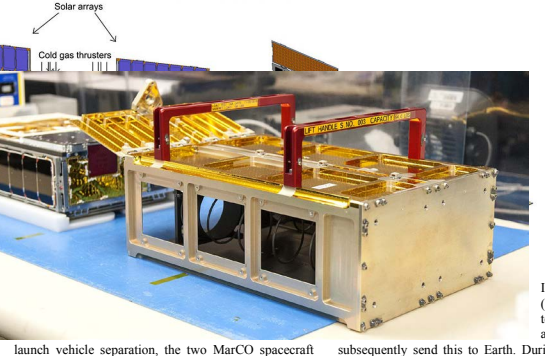
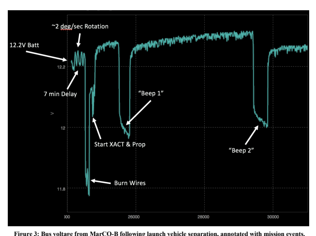
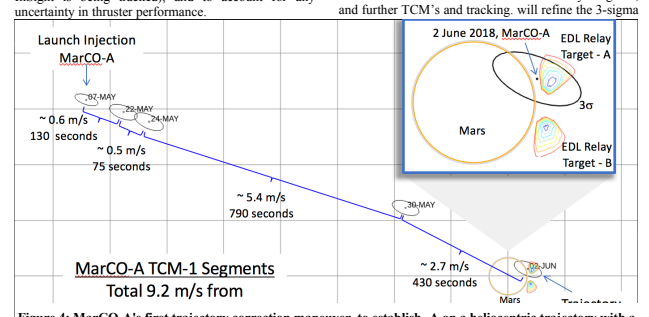
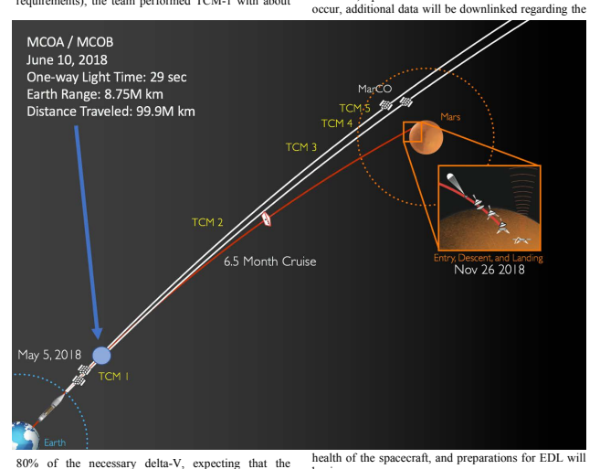

# Ssc18-Wkix-04 Marco: Early Operations Of The First Cubesats To Mars

Andrew Klesh, Brian Clement, Cody Colley, John Essmiller, Daniel Forgette, Joel Krajewski, Anne Marinan, Tomas Martin-Mur, Joel Steinkraus, David Sternberg, Thomas Werne, Brian Young Jet Propulsion Laboratory, California Institute of Technology 4800 Oak Grove Blvd, Pasadena, CA 91105; 818-354-4104 andrew.t.klesh@jpl.nasa.gov

## Abstract

The MarCO (Mars Cube One) spacecraft launched with the InSight mission from Vandenburg Airforce Base on May 5, 2018. These spacecraft, the first interplanetary CubeSats, serve as technology demonstrators, supporting the InSight Mars lander. During InSight's entry, descent, and landing sequence, the MarCO spacecraft will flyby Mars, collecting transmitted data from the lander, and relaying it back to the Deep Space Network (DSN) on Earth. This serves as a demonstrator for the "carry-your-own-relay" concept that might be utilized on more challenging future missions Prior to InSight support, the mission will also demonstrate the capability for a CubeSat sized, DSN compatible deep space transponder, to independently navigate from the Earth to Mars with a small spacecraft, and flight testing for numerous commercial products. In this paper, we present a status update of the mission, an overview of early operations, and an outline for the remainder of the mission to Mars. A broad description of the planetary protection approach that MarCO utilized is provided, as well as detail of the first trajectory correction maneuver.

## Introduction

May 5th, 2018 dawned foggy at Vandenburg Air Force Base, in Lompoc, California. Here, at 4:05am, the InSight Atlas 5-401 rocket leapt skyward, carrying the Mars InSight lander and two small secondary payloads - the Mars Cube One (MarCO) CubeSats. This marked the first time CubeSats had been launched on an interplanetary voyage, the first time three vehicles would be flying to Mars in loose proximity, and the first time secondary spacecraft have been used as a "carry-your-own-relay" concept for critical operations (InSight EDL).

Achieving these firsts directly resulted from a fastpaced design, integration, and test campaign, beginning in 2014, paused during the InSight launch slip, and restarted in September 2017 in preparation for the May 2018 launch. While the core team at JPL was small, it relied on collaboration with multiple commercial, university and government partners to bring the spacecraft to a flight-ready state.

## Vehicle Description

Each MarCO flight vehicle consists of a 6U CubeSat, approximately 36x24x10cm in size when stowed. The primary aluminum structure houses a Vacco cold gas propulsion system, with R-236FA propellant, a JPL Iris X-band transponder with UHF reception capability, Astrodev Command and Data Handling (CDH) and Electrical Power System (EPS), MMA deployable solar panels, Blue Canyon Technologies XACT attitude control system, JPL antennas (including high gain reflectarray), and two Gumstix boards & cameras. 

Together, each vehicle weighs approximately 14 kg and fits within a 6U Tyvak NLAS dispenser. See Figures 1 and 2 for a schematic of the spacecraft and photo of the flight vehicle and dispenser. Onboard flight software (*protos*) was developed at JPL, and the ground system was adapted from NASA's Advanced Multi-Mission Operations System 
(AMMOS). These are used in conjunction with the Deep Space Network for communication with each spacecraft. The team has also partnered with Morehead State University for X-band data reception, and SRI for UHF broadcast during early flight test.

## Mission Concept Of Operations

MarCO, like most Mars missions, launched on a trajectory that intentionally aimed away from Mars for planetary protection purposes (this avoids having to decontaminate the entirety of the launch vehicle's upper stage, a likely impossible task as it is exposed to Earth's atmosphere). Upon deployment, approximately 90 minutes after launch, and subsequent to InSight's own 

to relay telemetry data back from the InSight lander as it proceeds through EDL to landing on Mars. The Mars Reconnaissance Orbiter will simultaneously record the broad InSight signal (including telemetry data) and will subsequently send this to Earth. During EDL, a UHF 

Figure 1: Schematic of the Mars Cube One spacecraft (front and back) with front panel removed.

powered on for the first time since completing dispenser stowage some two months prior.

Early planned mission operations consisted of spacecraft checkout and deployment of panels and antennas. Within several weeks of launch, both MarCO's were scheduled to perform a trajectory correction maneuver (TCM), steering the flight path toward Mars, and removing the launch vehicle bias. Follow-on TCMs (up to 4 additional) throughout the mission allow for minor correction of the final flyby trajectory.

Following a 6.5-month cruise, and arriving at Mars on November 26, 2018, the MarCO spacecraft are planned carrier tone will be received by Earth, providing limited insight into descent events. Though the MarCO spacecraft are not required for InSight mission success, their presence and operations allow for near-real-time telemetry downlink and health monitoring of the EDL process.

After EDL data relay, the MarCO spacecraft will complete their demonstration objectives and primary mission by mid-December.

DEPLOYMENT
Figure 2: MarCO spacecraft (left) and Tyvak dispenser (right) prior to integration.

To avoid launch vehicle or primary spacecraft (InSight) 
interference, each MarCO was inhibited from opening panels or powering on the radio until verification of sun-light measured on the vehicle and at least 5 minutes following dispenser deployment. After this delay, the spacecraft energized each solar array burn-wire circuit three times (for redundancy), and subsequently turned on the attitude control system to despin and orient the spacecraft. Soon after, a scheduled "beep" mode was entered, where the radio began a short duration (5 min)
receive-transmit sequence, allowing the ground to receive the first data from orbit. As the spacecraft was designed to enter a sun-pointing spin, it was unclear if the antennas would be pointed correctly during this time. Several minutes later, a second 7-minute "beep" was scheduled. Figure 3 best illustrates actual onboard events through annotation of battery bus voltage. Significant drops occur when large loads (such as energizing burn-wires) 
are applied. As part of the solar arrays are still exposed when stowed, initial tumble rates are also provided. 

Both MarCO-A and MarCO-B successfully completed the initial deployment sequence. MarCO-A had a tumble rate of less than 0.5 deg per second, while -B was slightly faster at approximately 2 deg per second. Each spacecraft remained warm from launch, with onboard internal temperatures around 18 deg C. Solar panels were successfully actuated upon the first burncircuit excitation, and initial telemetry indicates they fully deployed. Each spacecraft also communicated with ground control during each beep opportunity, providing a first look at the deployment sequence and spacecraft health. Batteries were nearly fully charged at deployment, and subsequent looks indicated a power-positive state. Wheel rates remained low, the star tracker showed good expected performance, and the spacecraft remained in a stable attitude.

## Trajectory Correction Maneuvers

MarCO is pioneering meeting planetary protection requirements within the framework of a CubeSat mission. Classified as a Planetary Protection Category III flyby mission, the project is required to address both impact constraints for launch vehicle elements and the potential for contaminating InSight. Meeting these requirements by adopting the contamination analysis and control architecture typically applied to Mars missions would limit the benefits of the low-cost, highly-adaptable CubeSat paradigm. Instead, a strategy comprising bioassays of specific hardware, conservative bioburden estimation, and worst-case vehicle breakup and burnup analyses was employed to ensure Planetary Protection compliance. Yet as the launch vehicle did not (and could not) meet the stringent cleanliness requirements of a Mars impacter, the mission was specifically launched to offpoint from Mars. TCM's are used to re-align a spacecraft's trajectory towards its destination - in this case, to establish MarCO on a heliocentric trajectory that was coincident with a Mars flyby at the time of InSight's EDL.

To achieve this goal, up to five TCMs are planned, spread throughout the mission, and biased late to allow for final small adjustment. Small maneuvers early in the mission can account for large changes at the end, so early uncertainty is corrected once additional navigation tracking has been accomplished. To maintain appropriate distance between InSight and the two MarCO spacecraft, the MarCO TCM-1 sequence was performed after InSight, essentially providing the primary spacecraft "first-pick" of preferred flight path. Each MarCO's TCM was designed to best align for Mars flyby, to maintain the flight path within DSN 
coverage of InSight (which allows for multiplespacecraft-per-aperture reception of MarCO data when InSight is being tracked), and to account for any 

The MarCO spacecraft each have an onboard cold-gas propulsion system, capable of achieving greater than 30 m/s of delta-V. Early characterization of this system, both during desaturation maneuvers and a blow-down sequence (to empty the plenum) showed good performance, though slow compared to traditional 
"burns". Rather, the spacecraft perform closer to a lowthrust system, with multiple firings happening over minutes to achieve a desired delta-V. This has an inherent advantage, where tracking can occur between various stages, providing additional position estimation accuracy. The navigation team at JPL has made use of both ranging and Doppler tracking of the MarCO spacecraft to provide a position estimate. Later in the mission, delta-DOR tracking will be tested to refine this estimate. Over multiple days of simultaneous data downlink and ranging, each spacecraft's position was refined.

## Tcm-1: Marco-A

MarCO-A performed several TCM-1 over several stages, including several thruster calibration steps of less than 1 m/s to characterize the performance of the thrusters. In between the maneuvers, the team downlinked historical data and utilized two way coherent ranging to estimate the position of the spacecraft. During each firing, real-time Doppler data was used to verify maneuvers in progress, and an evaluation of signal-to-noise performance augmented the attitude control telemetry. The successful completion of the TCM places the expected flyby distance of MarCO-A in line with EDL Relay Target A, 
Figure 4: MarCO-A's first trajectory correction maneuver, to establish -A on a heliocentric trajectory with a coincident flyby of Mars on November 26, 2018.

uncertainty ellipse around this point.

## Tcm-1: Marco-B

Following a blow-down maneuver for thruster characterization early in the mission, a slight leak was detected from a thruster on MarCO-B. After characterizing the leak, and altering onboard behaviors to account for it, the team adopted a slightly different strategy for the second spacecraft. First, in anticipation that the leak might not end, or could change in the future, the spacecraft performs regular plenum chamber blowdowns at specified attitudes to keep the spacecraft pushing towards Mars. This reduces the need for extensive thruster firings during a traditional TCM. Second, as MarCO-B's launch injection was slightly more favorable than -A's (and had lower delta-V requirements), the team performed TCM-1 with about adjust this trajectory in upcoming months. Position estimation of the second spacecraft must account for additional non-gravitational forces in position estimation, and the team performs regular ranging on MarCO-B to minimize uncertainty in its position. Following TCM-1, MarCO-B is likewise well aligned for Mars flyby. The mid-summer TCM-2 will take advantage of additional time to characterize the leaky thruster, as well as slightly tweak the flyby location. 

## Cruise Phase

Over the next 5 months, the MarCO spacecraft will continue their more than 480 million kilometer journey to Mars. An idiosyncrasy of heliocentric orbits results in a maximum Earth-spacecraft distance of only 158 M 
km as the Earth is also traveling through space. During this time, up to four additional TCM maneuvers will 

begin.
ongoing leak will push the spacecraft towards the desired flyby location. The greater prop margin (due to the lower requirements) allows the team to further Compared to early checkout, DSN coverage is reduced during this period as operations are generally less Figure 5: Status and overview of the MarCO mission to Mars.

complex. The team will interact with the spacecraft roughly three times per week, and students from CalPoly-San Luis Obispo will provide mission support and data analysis. In early November, preparation for EDL will begin in earnest, with careful planning of desaturation maneuvers, recharge periods, and data downlink to best align the spacecraft capabilities to support InSight. During EDL itself, the spacecraft will remain inertially fixed, while the broad beamwidth of the UHF receive antenna allows for the rapid deceleration of InSight. Should the mission proceed well, each MarCO spacecraft will relay InSight telemetry back to Earth in near-real-time (excepting light-time delays), and downlink additional spacecraft recorded data of the event in the days following. By mid-December, the primary MarCO mission will be complete.

## Conclusions

The MarCO spacecraft have now entered cruise phase and are performing well. Initial deployment showed two healthy vehicles at minimal attitude rates, ready for spacecraft checkout. Following checkout, the first TCM 
maneuver aligned both spacecraft toward Mars, even though MarCO-B continues to account for an ongoing slight propellant leak through a thruster. After a 6.5 month cruise, the MarCO spacecraft will be ready to support InSight during EDL. As a technology demonstration mission, the MarCO spacecraft are proving the capability of a low-cost mission to survive and thrive in the deep space environment, and training scientists and engineers in the sometimes difficult world of operations. The limited energy budget available to MarCO causes for short communication passes and careful planning for activities. This can affect how quickly a TCM can occur, how to plan for the downlink of historical data, and how often the thruster system can be utilized. By the time MarCO reaches Mars, the spacecraft will have reached distances half a million times further than most CubeSats to date.

MarCO - the first interplanetary CubeSats - is blazing a trail for follow-on missions, and many additional lessons will come in the journey ahead.

## Acknowledgments

The research described here was carried out at the Jet Propulsion Laboratory, Caltech, under a contract with the National Aeronautics and Space Administration 
(NASA).