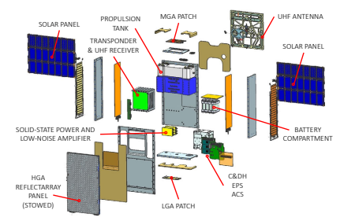
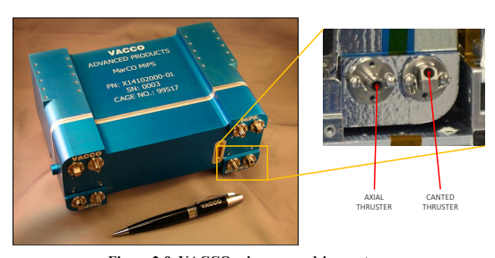
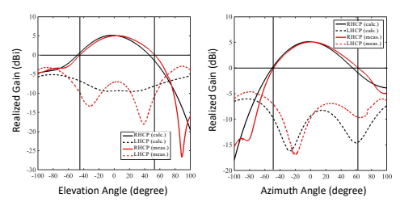
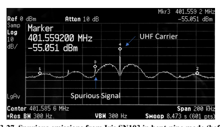
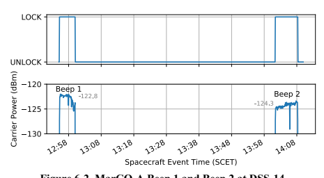

Mars Cube One Telecommunications Subsystem Design M. Michael Kobayashi, Mazen Shihabi, Jim Taylor

California Institute of Technology

Design and Performance Summary Series

# The Cover

Two spacecraft, collectively known as Mars Cube One (MarCO), launched on May 5, 2018, from Vandenberg Air Force Base at 4:05 a.m. Pacific Standard Time along with the Interior Exploration using Seismic Investigations, Geodesy and Heat Transport (InSight) mission to Mars. For its prime mission, MarCO supported InSight with real-time relay transmission during its entry, descent, and landing (EDL) to Mars. The illustration shows the two MarCO spacecraft at Mars with Earth in the distant background. The MarCO spacecraft, each on their own trajectory to reach Mars, performed a flyby during InSight's EDL to capture its signal to relay back to Earth. The MarCO spacecraft were CubeSats, a type of small satellite consisting of "units" that are 10 centimeters cubed, or about 4 inches on each side. Each MarCO CubeSat is the size of six CubeSat units, making it roughly 10 centimeters by 20 centimeters by 30 centimeters in its stowed configuration. Several deployable elements expanded the overall physical profile of the CubeSat. 

A set of solar panels on each side of the spacecraft folded out to power the spacecraft, the ultrahigh frequency (UHF) loop antenna deployed on the nadir panel facing Mars, and a large X-band reflectarray antenna folded out in a turkey-tail fashion. 

DESCANSO	Design	and	Performance	Summary	Series

Article	18 Mars	Cube	One	Telecommunications	Subsystem Design M. Michael Kobayashi Mazen Shihabi Jim Taylor Jet Propulsion Laboratory California Institute of Technology Pasadena, California National Aeronautics and Space Administration Jet Propulsion Laboratory California Institute of Technology Pasadena, California September 2021 This research was carried out at the Jet Propulsion Laboratory, California Institute of Technology, under a contract with the National Aeronautics and Space Administration. 

Reference herein to any specific commercial product, process, or service by trade name, trademark, manufacturer, or otherwise, does not constitute or imply endorsement by the United States Government or the Jet Propulsion Laboratory, California Institute of Technology.

Copyright 2021 California Institute of Technology. Government sponsorship acknowledged.

# Descanso Design And Performance Summary Series

Issued by the Deep Space Communications and Navigation Systems Center of Excellence Jet Propulsion Laboratory California Institute of Technology Jon Hamkins, Editor-in-Chief Published Articles in This Series Article 1**—"Mars Global Surveyor Telecommunications"** Jim Taylor, Kar-Ming Cheung, and Chao-Jen Wong Article 2**—"Deep Space 1 Telecommunications"** Jim Taylor, Michela Muñoz Fernández, Ana I. Bolea Alamañac, and Kar-Ming Cheung Article 3**—"Cassini Orbiter/Huygens Probe Telecommunications"** Jim Taylor, Laura Sakamoto, and Chao-Jen Wong Article 4**—"Voyager Telecommunications"** Roger Ludwig and Jim Taylor Article 5**—"Galileo Telecommunications"**
Jim Taylor, Kar-Ming Cheung, and Dongae Seo Article 6**—"Odyssey Telecommunications"** Andre Makovsky, Andrea Barbieri, and Ramona Tung Article 7**—"Deep Space 1 Navigation: Extended Missions"** Brian Kennedy, Shyam Bhaskaran, J. Edmund Riedel, and Mike Wang Article 8**—"Deep Space 1 Navigation: Primary Mission"**
Brian Kennedy, J. Edmund Riedel, Shyam Bhaskaran, Shailen Desai, Don Han, Tim McElrath, George Null, Mark Ryne, Steve Synnott, Mike Wang, and Robert Werner Article 9**—"Deep Impact Flyby and Impactor Telecommunications"** Jim Taylor and David Hansen Article 10**—"Mars Exploration Rover Telecommunications"** Jim Taylor, Andre Makovsky, Andrea Barbieri, Ramona Tung, Polly Estabrook, and A. Gail Thomas Article 11—" Mars Exploration Rover **Navigation"**
Louis A. D'Amario i Article 12—"Mars Reconnaissance Orbiter **Telecommunications"**
Jim Taylor, Dennis K. Lee, and Shervin Shambayati Article 13**—"Dawn Telecommunications"**
Jim Taylor Article 14—"Mars Science Laboratory **Telecommunications Systems Design"** Andre Makovsky, Peter Ilott, and Jim Taylor Article 15**—"Phoenix Telecommunications"** Jim Taylor, Stan Butman, Chad Edwards, Peter Ilott, Richard Kornfeld, Dennis Lee, Scott Shaffer, and Gina Signori Article 16—"Juno **Telecommunications"**
Ryan Mukai, David Hansen, Anthony Mittskus, Jim Taylor, Monika Danos, and Andrew Kwok Revision A: Addition of Operations from Early Cruise through First Months of Operation, Five Science Orbits (Sept. 2012–May 2017) Article 17**—"Cassini Navigation Performance Assessment"**
Duane Roth, Sonia Hernandez, and Sean Wagner Article 18**—"Mars Cube One Telecommunications Subsystem Design"**
M. Michael Kobayashi, Mazen Shihabi, and Jim Taylor

# Foreword

This Design and Performance Summary Series, issued by the Deep Space Communications and Navigation Systems Center of Excellence (DESCANSO), is a companion series to the DESCANSO Monograph Series. Authored by experienced scientists and engineers who participated in and contributed to deep-space missions, each article in this series summarizes the design and performance of major systems, such as communications and navigation, for each mission. In addition, the series illustrates the progression of system design from mission to mission. Lastly, the series collectively provides readers with a broad overview of the mission systems described.

Jon Hamkins DESCANSO Leader Blank

# Preface

Mars Cube One (MarCO), the first CubeSat mission to go beyond Earth orbit, was a technology demonstration mission providing many of the functions of much larger spacecraft. The two MarCO spacecraft were launched together with the InSight lander on May 5, 2018. All reached Mars on November 26, with InSight completing an Entry-Descent-Landing to the surface. The two MarCOs were independently each relaying InSight data to Earth as it was received while they completed Mars flybys about 3,500 km (2,200 miles) overhead. With MarCO flying in an inertial attitude, the radio signal from Insight reached MarCO via a broad-beam antenna and was sent on to Deep Space Network stations on Earth via a high-gain antenna. InSight transmitted its data at UHF, and MarCO converted the signal to X-band in a bent-pipe mode. The mission achieved the important objective of demonstrating JPL's ability to efficiently execute a schedule-driven Type-II (risk class D) mission of MarCO's complexity. Each CubeSat carried a miniaturized deep-space radio that could communicate at several data rates and provide navigation data to the flight software. MarCO had a deployable flat-panel antenna for transmitting InSight's 8 kbps EDL telemetry to the DSN. After launch, each MarCO was deployed by a spring-release mechanism from a CubeSat dispenser. Initial activities included the deployment of the high-gain and UHF antennas. MarCO carried both a color wide-field camera to confirm HGA deployment and a color narrow-field camera pointed in the opposite direction toward the UHF antenna. MarCO navigated to Mars using the Sun and stars, and corrected its course with a set of thrusters. Before and after the EDL mission phase, MarCO was in a heliocentric orbit. The MarCO radios were configured in additional command, telemetry and radiometric (Doppler and ranging) modes for technology demonstration in-flight testing. In the last week of 2018 and the first week of 2019 after previous uneventful contacts in the days before, MarCO-B and then MarCO-A did not contact scheduled tracking stations. After no success in contacting them, the project declared the end of the prime mission February 2, 2019. After a re-contact campaign at closer ranges to the Sun and Earth in September 2019 was also unsuccessful, the project declared the end of mission February 2, 2020.

Blank

# Acknowledgments

Government sponsorship acknowledged. The research work described in this paper was carried out at the Jet Propulsion Laboratory, California Institute of Technology, under a contract with the National Aeronautics and Space Administration. The material in this article is a compilation of various MarCO project documents and presentations, and informed by published papers in the References. The Iris Transponder and the telecom subsystem for MarCO was a team effort with inputs from various subject matter experts. The authors would like to thank the following for their contributions to the Iris development: 

| Fernando Aguirre  Krisjani Angkasa  Eric Archer  Sami Asmar John Baker  David Bell  Maxwell Bryk Brandon Burgett  Nacer Chahat  Matthew Chase  Jimmy Chen  Michael Ciminera  Cody Colley Robert Cong  Brian Custodero  Sandip Dasgupta  Faramaz Davarian  Emmanuel Decrossas  Robert Dengler  Tatyana Dobreva  Deborah Drake  Courtney Duncan  Charles Dunn  Larry Epp  Carlos Esproles  Daniel Forgette Alex Hackett   | Salman Haque  Don Heyer  Jeff Hilland  Richard Hodges  Sarah Holmes  Dan Hoppe  Peter Illot  Matt Keyaway  Alfred Khashaki  Michael Kilzer  Andy Klesh Joel Krajewski Sanford Krasner Igor Kuperman  Jorge Landa  Kameron Larsen  Norman Lay Joseph Lazio John Leichty  Dorothy Lewis  Jim Lux  Tuyen Ly  Andrew Maclurg  Benjamin Malphrus Anne Marinan Lauren McNally  Ricardo Mendoza   | Hadi Mojaradi Ronald Morgan  Quintin Ng  Danh Nguyen  Clayton Okino Heather Owen  Alex Peralta  Michael Pugh  Ray Quintero  Dan Rascoe  Josh Ravich  Richard Rebele  Edgar Satorius  Douglas Sheldon  Amy Smith  Mary Soria  Joel Steinkraus  Stephen Townes Thaddaeus Voss  Stefan Waldherr  Gerry Walsh  Douglas Wang  Li Ann Wong  Anusha Yarlagadda  Serjik Zadourian Sam Zingales   |
|-------------------------------------------------------------------------------------------------------------------------------------------------------------------------------------------------------------------------------------------------------------------------------------------------------------------------------------------------------------------------------------------------------------------------|--------------------------------------------------------------------------------------------------------------------------------------------------------------------------------------------------------------------------------------------------------------------------------------------------------------------------------------------------------------------------------------------|------------------------------------------------------------------------------------------------------------------------------------------------------------------------------------------------------------------------------------------------------------------------------------------------------------------------------------------------------------------------------------------|

The clarity of this article's text and figures is improved by the interaction we enjoyed with the technical editors, and we would like to acknowledge Samantha Ozyildirim and Mary Young for their help with the article.

Blank

# Table Of Contents

| 1                                                                                                                  | Mission Description..................................................................................................................1   |                              |
|--------------------------------------------------------------------------------------------------------------------|------------------------------------------------------------------------------------------------------------------------------------------|------------------------------|
| 1.1                                                                                                                | Project and Mission Objectives                                                                                                           |                              |
| 1.1.1                                                                                                              | Level 1 Project Requirements .                                                                                                           |                              |
| 1.1.2                                                                                                              | Technology Demonstration Goals .                                                                                                         |                              |
| Other Important MarCO Objectives                                                                                   |                                                                                                                                          |                              |
| 1.1.3                                                                                                              |                                                                                                                                          |                              |
| 1.2                                                                                                                | InSight Mission Overview                                                                                                                 |                              |
| InSight Science Goals                                                                                              |                                                                                                                                          |                              |
| 1.2.1                                                                                                              |                                                                                                                                          |                              |
| 1.2.2                                                                                                              | InSight's Investigations and Corresponding Instruments ...................................... 6                                          |                              |
| 1.3                                                                                                                | MarCO Mission Phases .                                                                                                                   |                              |
| 1.3.1                                                                                                              | Launch, Deployment, and Initial Acquisition Phase ............................................... 7                                      |                              |
| 1.3.2                                                                                                              | Cruise Phase                                                                                                                             |                              |
| Approach Phase                                                                                                     |                                                                                                                                          |                              |
| 1.3.3                                                                                                              |                                                                                                                                          |                              |
| 1.3.4                                                                                                              | Mars Encounter and Support of InSight's EDL Phase ...................................... 11                                              |                              |
| Post-EDL/Extended Mission Phase ............................................................................... 13 |                                                                                                                                          |                              |
| 1.3.5                                                                                                              |                                                                                                                                          |                              |
| 2                                                                                                                  | MarCO Spacecraft Overview                                                                                                                |                              |
| 2.1                                                                                                                | CubeSat Structure                                                                                                                        |                              |
| Power                                                                                                              |                                                                                                                                          |                              |
| 2.2                                                                                                                |                                                                                                                                          |                              |
| 2.3                                                                                                                | Propulsion .                                                                                                                             |                              |
| 2.4                                                                                                                | Attitude Control .                                                                                                                       |                              |
| Command and Data Handling.                                                                                         |                                                                                                                                          |                              |
| 2.5                                                                                                                |                                                                                                                                          |                              |
| 2.6                                                                                                                | Payload Cameras                                                                                                                          |                              |
| Telecommunications Subsystem Overview..............................................................25              |                                                                                                                                          |                              |
| 3                                                                                                                  | 3.1                                                                                                                                      | X-band for Telecom Subsystem |
| I                                                                                                                  |                                                                                                                                          |                              |
| 3.1.1                                                                                                              |                                                                                                                                          |                              |
| 3.1.2                                                                                                              | Iris Deep Space Transponder                                                                                                              |                              |
| 3.1.3                                                                                                              | Solid-State Power Amplifier                                                                                                              |                              |
| 3.1.4                                                                                                              | Low-Noise Amplifier                                                                                                                      |                              |
| 3.1.5                                                                                                              | A Antennas .                                                                                                                             |                              |
| 3.1.5.1                                                                                                            | Low-Gain Patch Antennas                                                                                                                  |                              |
| 3.1.5.2                                                                                                            | Medium-Gain Patch Antennas                                                                                                               |                              |
| High-Gain Reflectarray Antenna                                                                                     |                                                                                                                                          |                              |
| 3.1.5.3                                                                                                            |                                                                                                                                          |                              |
| 3.2                                                                                                                | UHF for Telecom Subsystem                                                                                                                |                              |
| 3.2.1                                                                                                              | I III III II                                                                                                                             |                              |
| 3.2.2                                                                                                              | Iris UHF Receiver                                                                                                                        |                              |
| 3.2.3                                                                                                              | UHF Loop Antenna .                                                                                                                       |                              |
| 3.3                                                                                                                | Telecom Subsystem Mass and Power                                                                                                         |                              |
| 3.4                                                                                                                | Post-Delivery Mitigations, Modifications, and Enhancements ......................................... 45                                  |                              |
| MarCO UHF EMI Mitigation .                                                                                         |                                                                                                                                          |                              |
| 3.4.1                                                                                                              |                                                                                                                                          |                              |
| 3.4.2                                                                                                              | MarCO Frame Arbitration Optimization .................................................................... 47                             |                              |
| 3.4.3                                                                                                              | MarCO Post-Launch Additional Features ............................................................. 47                                   |                              |
| 4                                                                                                                  | New Ground System Techniques Used with MarCO...........................................49                                                |                              |
| 4.1                                                                                                                | OMSPA Using MSU Ground Station (DSS-17)                                                                                                  |                              |
| 4.2                                                                                                                | OMSPA Arraying                                                                                                                           |                              |

5 6 7 8 9

| Link Performance Estimates ...................................................................................................54                        |                                                                                                                                           |
|---------------------------------------------------------------------------------------------------------------------------------------------------------|-------------------------------------------------------------------------------------------------------------------------------------------|
| 5.1                                                                                                                                                     | X-band Uplink                                                                                                                             |
| 5.2                                                                                                                                                     | X-band Downlink                                                                                                                           |
| 5.3                                                                                                                                                     | UHF Return Link                                                                                                                           |
| Channel Frequencies and Bandwidths (Spectrum Allocation)                                                                                                |                                                                                                                                           |
| 5.4                                                                                                                                                     |                                                                                                                                           |
| In-Flight Performance                                                                                                                                   |                                                                                                                                           |
| 6.1                                                                                                                                                     | Initial Acquisition                                                                                                                       |
| 6.1.1                                                                                                                                                   | MarCO-A Downlink Beeps .                                                                                                                  |
| 6.1.2                                                                                                                                                   | MarCO-B Downlink Beeps .                                                                                                                  |
| 6.1.3                                                                                                                                                   | Command Uplink                                                                                                                            |
| 6.2                                                                                                                                                     | HGA Calibration                                                                                                                           |
| 6.3                                                                                                                                                     | Cruise                                                                                                                                    |
| 6.4                                                                                                                                                     | Bent-Pipe Demonstration                                                                                                                   |
| 6.5                                                                                                                                                     | InSight EDL                                                                                                                               |
| 6.6                                                                                                                                                     | Post-EDL Radio Science .                                                                                                                  |
| 6.7                                                                                                                                                     | Mission End                                                                                                                               |
| Lessons Learned .....................................................................................................................84                 |                                                                                                                                           |
| 7.1                                                                                                                                                     | Lessons from the Development Phase .                                                                                                      |
| Lessons from the Integration and Test Phase ...................................................................................... 85                   |                                                                                                                                           |
| 7.2                                                                                                                                                     |                                                                                                                                           |
| 7.3                                                                                                                                                     | Lessons from the Operation Phase ......................................................................................................87 |
| References ..........................................................................................................................................88 |                                                                                                                                           |
| Abbreviations, Acronyms, and Nomenclature ........................................................91                                                    |                                                                                                                                           |

## List Of Figures

| Figure 1-1. Communication at Mars during InSight's EDL...................................................................... 1                  |
|-------------------------------------------------------------------------------------------------------------------------------------------------|
| Figure 1-2. MarCO's planned cruise to Mars.                                                                                                     |
| Figure 1-3. InSight's EDL event timeline vs. MarCO UHF signal key events. ................................... 4                                 |
| Figure 1-4. An overview of the OMPSA scheme. .                                                                                                  |
| Figure 2-1. MarCO CubeSat in fully deployed configuration. .............................................................. 17                    |
| Figure 2-2. MarCO CubeSat in its stowed configuration, showing the eight thrusters and                                                          |
| medium-gain patch antennas                                                                                                                      |
| Figure 2-3. MarCO key hardware elements..................................................................................................... 18 |
| Figure 2-4. Photograph of MarCO's interior taken during integration and test. .......................... 18                                     |
| Figure 2-5. Exploded view of the MarCO CubeSat centered around the main baseplate. ......... 19                                                 |
| Figure 2-6. MarCO CubeSat to be installed into the NLAS Mark II dispenser............................... 19                                     |
| Figure 2-7. HaWK solar array deployment steps.                                                                                                  |
| Figure 2-8. MarCO mission power profile. .                                                                                                      |
| Figure 2-9. VACCO micro-propulsion system.                                                                                                      |
| Figure 2-10. VACCO MiPS schematic. .                                                                                                            |
| Figure 2-11. XACT unit for MarCO.                                                                                                               |

| Figure 2-12. Uplink transfer frame structure 23 Figure 2-13. Downlink data frame structure 24 Figure 2-14. NFOV and WFOV camera assembly 24 Figure 3-1. MarCO communication links 25 Figure 3-2. MarCO communication links 27 Figure 3-3. Simplified block diagram of Iris transponder including the UHF receiver unit 29 Figure 3-4. Iris deep-space transponder for MarCO 30 Figure 3-5. RaDiX board (left: top side; right: bottom side) 31 Figure 3-6. Power supply board (left: top side; right: bottom side) 31 Figure 3-7. X-band receiver board (left: top side; right: bottom side) 32 Figure 3-8. X-band exciter board (left: top side; right: bottom side) 32 Figure 3-9. X-band SSPA (RF side) 33 Figure 3-10. X-band LNA (RF side) 33 Figure 3-11. Fabricated X-band LGAs 35 Figure 3-12. Calculated and measured radiation pattern of Rx-LGA at 7167.5 MHz 35 Figure 3-13. Calculated and measured radiation pattern of Tx-LGA at 8425.0 MHz 35 Figure 3-14. Fabricated X-band MGAs 36 Figure 3-15. Calculated and measured radiation pattern of Rx-MGA at 7167.5 MHz 37 Figure 3-16. Calculated and measured radiation pattern of Tx-MGA at 8425.0 MHz 37 Figure 3-17. HGA reflectarray panel in deployed configuration 38 Figure 3-18. HGA reflectarray physical structure 39 Figure 3-19. HGA geometry at Mars 39 Figure 3-20. HGA microstrip patch array feed 40 Figure 3-21. Measured radiation pattern of HGA at 8425.0 MHz 40 Figure 3-22. UHF dynamics from InSight's EDL to Mars 41 Figure 3-23. UHF data flow 42 Figure 3-24. Assembled UHF receiver slice (left: top side; right: bottom side) 43 Figure 3-25. Fabricated UHF loop antenna 44 Figure 3-26. Calculated and measured UHF antenna radiation pattern 44 Figure 3-27. Spurious emissions from Iris SN103 in bent-pipe mode (before fix) 46 Figure 3-28. Spurious emissions from Iris SN103 in bent-pipe mode (after fix) 47 Figure 4-1. MSU Space Science Center 21 m antenna [33] 50 Figure 4-2. Visual overview of the OMPSA arraying concept [32] 52 Figure 4-3. Arraying MarCO-A and MarCO-B on DSS-54 and DSS-55 53 Figure 5-1. X-band LGA uplink margin from DSN 34 m aperture 57 Figure 5-2. X-band MGA uplink margin from DSN 34 m aperture 57 Figure 5-3. X-band LGA downlink margin to DSN 34 m aperture 60 Figure 5-4. X-band MGA downlink margin to DSN 34 m and 70 m apertures 60 Figure 5-5. X-band HGA downlink 8 kbps margin to DSN 34 m and 70 m apertures 61   |
|----------------------------------------------------------------------------------------------------------------------------------------------------------------------------------------------------------------------------------------------------------------------------------------------------------------------------------------------------------------------------------------------------------------------------------------------------------------------------------------------------------------------------------------------------------------------------------------------------------------------------------------------------------------------------------------------------------------------------------------------------------------------------------------------------------------------------------------------------------------------------------------------------------------------------------------------------------------------------------------------------------------------------------------------------------------------------------------------------------------------------------------------------------------------------------------------------------------------------------------------------------------------------------------------------------------------------------------------------------------------------------------------------------------------------------------------------------------------------------------------------------------------------------------------------------------------------------------------------------------------------------------------------------------------------------------------------------------------------------------------------------------------------------------------------------------------------------------------------------------------------------------------------------------------------------------------------------------------------------------------------------------------------------------------------------------------------------------------------------------------------------------------------------------------------------------------------------------------------------------------------------------------------------------------------------------------------------------------------------------------------------------------------------------------------------------------------------------------|

| Figure 5-6. InSight and MarCO trajectories at InSight EDL to Mars 62 Figure 5-7. InSight-MarCO range and Doppler dynamics at InSight EDL to Mars 63 Figure 5-8. InSight-MarCO range and Doppler dynamics at InSight EDL to Mars 65 Figure 6-1. Timeline of MarCO-InSight separation through initial acquisition beeps 67 Figure 6-2. MarCO-A Beep 1 and Beep 2 at DSS-14 68 Figure 6-3. MarCO-B Beep 1 and Beep 2 at DSS-14 68 Figure 6-4. MarCO HGA characterization pointing angles 69 Figure 6-5. MarCO-A HGA characterization fine (±2°) pointing calibration 70 Figure 6-6. MarCO-A HGA characterization coarse (±5°) pointing calibration 70 Figure 6-7. MarCO scheduled passes at various DSN stations during the mission 71 Figure 6-8. MarCO pass counts to DSN complexes 72 Figure 6-9. MarCO uplink rates over mission time 72 Figure 6-10. MarCO uplink rate counts 73 Figure 6-11. MarCO downlink rates over mission time 73 Figure 6-12. MarCO downlink rate counts 74 Figure 6-13. MarCO RTLT over mission time 74 Figure 6-14. MarCO antenna angles for early bent-pipe demonstration 75 Figure 6-15. MarCO UHF bent-pipe early test 76 Figure 6-16. MarCO UHF bent-pipe test with signal dropouts 76 Figure 6-17. Timeline of MarCO events around InSight EDL 77 Figure 6-18. MarCO-A UHF telemetry during InSight EDL 78 Figure 6-19. MarCO-B UHF telemetry during InSight EDL 79 Figure 6-20. MarCO-A vs. MarCO-B received UHF data volume during InSight EDL 80 Figure 6-21. DSN X-band carrier power estimate for MarCO-A and MarCO-B during  InSight EDL 80 Figure 6-22. Retransmission of EDL stored data from MarCO-A and MarCO-B 81 Figure 6-23. Image of Mars on Mars approach by MarCO-B WFOV camera shortly before  InSight EDL 81 Figure 6-24. First InSight image of the surface of Mars received on Earth as transmitted  through MarCO 82   |
|-----------------------------------------------------------------------------------------------------------------------------------------------------------------------------------------------------------------------------------------------------------------------------------------------------------------------------------------------------------------------------------------------------------------------------------------------------------------------------------------------------------------------------------------------------------------------------------------------------------------------------------------------------------------------------------------------------------------------------------------------------------------------------------------------------------------------------------------------------------------------------------------------------------------------------------------------------------------------------------------------------------------------------------------------------------------------------------------------------------------------------------------------------------------------------------------------------------------------------------------------------------------------------------------------------------------------------------------------------------------------------------------------------------------------------------------------------------------------------------------------------------------------------------------------------------------------------------------------------------------------------------------------------------------------------------------------------------------------------------------------------------------------------------------------------------------------------------------------------------------------------|

## List Of Tables

| Table 1-1. MarCO key mission events timeline 2 Table 1-2. MarCO mission objectives 5 Table 3-1. MarCO telecom-centric mission timeline 26 Table 3-2. X-band signal parameters 27 Table 3-3. LGA requirements 34   |
|-------------------------------------------------------------------------------------------------------------------------------------------------------------------------------------------------------------------|

| Table 3-4. MGA requirements 36 Table 3-5. HGA requirements 38 Table 3-6. HGA feed requirements 40 Table 3-7. UHF signal parameters 41 Table 3-8. UHF antenna requirements 43 Table 3-9. MarCO post-launch additional features 45 Table 3-10. MarCO telecom subsystem power (watts) 45 Table 3-11. MarCO post-launch additional features 48 Table 4-1. X-band ground station characteristics [33] 50 Table 4-2. Assessment of MSU sample data record fidelity from InSight/MarCO launch  window [35] 52 Table 5-1. X-band downlink signal parameters 54 Table 5-2. X-band uplink signal parameters 54 Table 5-3. X-band uplink link budget 55 Table 5-4. X-band downlink link budget 58 Table 5-5. MarCO-Insight UHF link budget 64 Table 5-6. MarCO-Insight UHF uplink/downlink frequency and bandwidth allocations 66 Table 6-1. MarCO HGA calibration sessions 70   |
|-----------------------------------------------------------------------------------------------------------------------------------------------------------------------------------------------------------------------------------------------------------------------------------------------------------------------------------------------------------------------------------------------------------------------------------------------------------------------------------------------------------------------------------------------------------------------------------------------------------------------------------------------------------------------------------------------------------------------------------------------------------------------------------------------------------------------------------------------------------------------|

## 1 Mission Description

Two spacecraft, collectively known as Mars Cube One (MarCO), accompanied the Interior Exploration using Seismic Investigations, Geodesy and Heat Transport (InSight) lander to Mars. 

InSight and the MarCO spacecraft, MarCO-A and MarCO-B, arrived at Mars on November 26, 2018, after a 6.5-month cruise. Like all past Mars landers, InSight experienced the so-called "seven minutes of terror" as the spacecraft autonomously transitioned from interplanetary speeds to a landed craft through its entry, descent, and landing (EDL) mission phase. During the InSight EDL, MarCO flew past Mars, returning InSight EDL data in real time, delayed only by the one-way light time (OWLT). Mars was over 160 million km (1.07 AU) from Earth during InSight's EDL, with an OWLT that was also coincidentally seven minutes. By the time mission control on Earth received the signals from the first moment of EDL, InSight was already on the ground, "dead or alive." To help mission managers assess the situation, several assets were used to monitor the arriving lander during the critical seven minutes. The Mars Reconnaissance Orbiter (MRO) and the Mars Odyssey orbiter provided a relay of data back to Earth. However, during InSight's EDL, MRO immediately passed behind the planet, blocking communication back to Earth. This delayed transmission of MRO's recording of the EDL events by several hours. Odyssey's orbit did not align with InSight's landing zone until nearly half a day after EDL. The Jet Propulsion Laboratory (JPL) developed MarCO to provide near-real-time relay transmission from InSight during EDL and reduce the risk of being unable to respond quickly to correctable problems on the Martian surface after this critical phase. Figure 1-1 depicts the communication links between the lander descending to the surface of Mars, 

 MRO in orbit around Mars, and the MarCO spacecraft flying past Mars in line-of-sight with InSight. The MarCO spacecraft were CubeSats, a type of small satellite consisting of "units" that are 10 centimeters cubed, or about 4 inches on each side. Each MarCO CubeSat was the size of six CubeSat units, making it roughly 10 centimeters by 20 centimeters by 30 centimeters in its stowed configuration. Each MarCO CubeSat flew independently to Mars and performed a flyby of Mars at an altitude of 3,500 km during the InSight EDL. Each spacecraft received the InSight EDL data, added framing information, and retransmitted the data to Earth, providing a near-realtime relay for InSight EDL. The MarCO technology demonstration mission highlights the capability of CubeSats to support larger missions during critical events—a "carry-your-own-relay" option for future such encounters [1]. The MarCO mission key events are listed in Table 1-1. Events between launch and InSight's EDL are detailed in the following paragraphs. The MarCO CubeSats launched together with InSight aboard an Atlas V-401 from Vandenberg Air Force Base at 4:05 a.m. Pacific Standard Time on May 5, 2018. The MarCO CubeSats were each mounted in a Tyvak Nanosatellite Launch Adapter System (NLAS) Mark II dispenser on the aft bulkhead carrier of the Centaur upper stage. InSight separated from the upper stage approximately 90 minutes after launch, followed by deployment of each MarCO CubeSat via the spring-release mechanism of the NLAS dispenser. During MarCO's initial acquisition phase, various checkouts were performed to verify the health of the spacecraft as well as the onboard subsystems, such as power and attitude control. Initial acquisition also included deployment of the MarCO high-gain and ultra-high frequency (UHF) antennas.

| MarCO Key Mission Events           | Date              |
|------------------------------------|-------------------|
| Launch and Commissioning Start     | May 5, 2018       |
| Commissioning End and Cruise Start | May 17, 2018      |
| MarCO Cruise End and InSight EDL   | November 26, 2018 |
| MarCO Post-EDL Activities Start    | November 26, 2018 |
| MarCO-B Last Contact               | December 28, 2018 |
| MarCO-B Next Scheduled Contact     | December 31, 2018 |
| MarCO-A Last Contact               | January 4, 2019   |
| MarCO-A Next Scheduled Contact     | January 7, 2019   |
| End of Prime Mission Declared      | February 2, 2019  |
| Re-contact Attempts                | September 2019    |
| End of Mission                     | February 2, 2020  |

The 6.5-month cruise phase to Mars included trajectory correction maneuvers (TCMs)1 to refine the Mars flybys and to assure planetary protection requirements were met (see Figure 1-2). The navigation team planned for four TCMs for each MarCO with TCM-5 as a backup to TCM-4. MarCO-A and MarCO-B each executed TCMs in May, August, and October 2018, and MarCO-B 

executed a fourth TCM in November. During cruise, NASA's Deep Space Network (DSN) performed navigation and tracking several times per week, as operators continued to monitor health and prepare for the EDL flybys. Upon arrival at Mars, the MarCO CubeSats performed their flybys at an altitude of approximately 3,500 km. Each spacecraft oriented to an inertially fixed position, with the broad-beam UHF antenna pointed toward InSight and the X-band high-gain antenna (HGA) pointed toward Earth. The EDL sequence was completed under battery power, as the antenna pointing constraints meant the solar arrays could not be pointed directly at the Sun. During EDL, real-time telemetry data was transmitted in a "bent-pipe" mode: on UHF from InSight to MarCO at 8 kilobits per second (kbps) and retransmitted on X-band by MarCO at the same rate to the DSN's 70 m dish in Madrid, Spain.

Figure 1-3 depicts InSight's EDL event timeline2 against key events from MarCO's perspective. 

After InSight separated from the cruise-stage vehicle, InSight began to transmit a return-link UHF carrier tone. This carrier tone aided signal acquisition on MarCO's receiver. After InSight performed its final attitude correction for atmospheric entry, data modulation added to the carrier tone began sending back health and status information from InSight approximately 2 minutes before Mars atmosphere entry. During the hypersonic phase, as InSight rapidly decelerated from atmospheric friction, peak heating of the heat shield began to form a plasma cloud around the entry probe, which introduced large signal attenuation. Both MarCO-A and MarCO-B experienced so-called plasma brownout 

and blackout periods in UHF communications during Mars atmospheric entry. Though signal attenuation and degradation occur during a brownout, the UHF receiver maintains carrier lock. During a blackout, the receiver drops lock and goes into acquisition mode searching for the UHF carrier. Brief signal dropouts and reacquisitions also occurred when the InSight parachute was deployed and when the lander separated from the descent vehicle. After each link disruption (gap), the UHF receiver on each MarCO spacecraft regained lock and continued to receive data from InSight. Each MarCO CubeSat transmitted EDL data at X-band to Earth, continuing through touchdown to approximately 5 minutes past touchdown.

## 1.1 Project And Mission Objectives

MarCO was a technology demonstration project with a prime mission to relay InSight's EDL data. In addition to the Level 1 requirements listed in Section 1.1.1, the MarCO mission was required to "do no harm" to the InSight mission.

## 1.1.1 Level 1 Project Requirements

- The MarCO spacecraft shall be launched with the InSight launch vehicle. - The MarCO spacecraft shall provide an 8 kbps real-time relay for InSight EDL.

- The MarCO spacecraft design shall fit the CubeSat form factor with associated deployment technology.

## 1.1.2 Technology Demonstration Goals

MarCO was the first CubeSat mission to go beyond Earth orbit. It paved the way for future interplanetary CubeSat missions, and thus has provided strategic advantages for NASA's leadership role in deep-space exploration. A unique data set and operations experience were collected from the mission that provided in-flight validation of various CubeSat components' endurance and navigation capabilities in deep space. Several key technology demonstration objectives are listed in Table 1-2.

| Technology              | Mission Objective                                           |
|-------------------------|-------------------------------------------------------------|
| Miniaturized Deep-space | Communicate at multiple data rates and provide navigational |
| Radio                   | products                                                    |
| Flat-panel Antenna      | Transmit telemetry at 8 kbps                                |
| TCMs on a CubeSat       | Execute TCM-1                                               |
| CubeSat in Deep Space   | Operate beyond low Earth orbit (LEO)                        |
| Relay                   | Transmit data in bent-pipe mode during InSight EDL          |

## 1.1.3 Other Important Marco Objectives

Another important objective met by the MarCO mission included demonstrating JPL's ability to efficiently execute a schedule-driven Type-II (risk class D) mission3 of MarCO's complexity
[2, 3]. CubeSat programs and Class-D missions, such as ASTERIA (Arcsecond Space Telescope Enabling Research in Astrophysics), RainCube (Radar in a CubeSat), ECOSTRESS (Ecosystem Spaceborne Thermal Radiometer Experiment on Space Station), and others, are primarily technology demonstration missions that provide a wealth of data and experience that JPL can apply towards larger missions and higher risk classification missions. The experience allows JPL to experiment with and optimize project implementation models as well.

## 1.2 Insight Mission Overview

InSight is a Mars lander designed to give the interior of the Red Planet its first thorough assessment, a "checkup" after the planet formed 4.5 billion years ago. InSight is the first outer space robotic explorer to study in-depth the "inner space" of Mars: its crust, mantle, and core. Studying Mars' interior structure answers key questions about the early formation of the terrestrial (rocky) planets in the inner solar system—Mercury, Venus, Earth, and Mars—as well as rocky exoplanets and Earth's Moon. InSight also measures tectonic activity and meteorite impacts on Mars today. The lander's instruments delve deep beneath the surface to seek evidence of the processes that formed the terrestrial planets. InSight conducts the planet's "checkup" by measuring the planet's vital signs: its "pulse" (through seismology), "temperature" (from heat flow), and "reflexes" (with geodesy by radio science) [4]. The InSight mission is part of NASA's Discovery Program for highly focused science missions that seek to address critical questions in solar system science.

## 1.2.1 Insight Science Goals

InSight's major science goal is to understand the formation and evolution of all terrestrial planets through investigation of the interior structure and processes of Mars. The four inner planets of the solar system, plus Earth's Moon, are called terrestrial worlds because they share a closer kinship with each other than with the worlds farther from the Sun. Diverse as they are, they each have rocky surfaces and each have high density indicating their interiors have even denser ingredients than their surface rocks. All of the terrestrial planets have a three-part layered structure: 
- At the center is a metallic, iron-rich core, part of which may be molten. - Above the core is a thick middle layer called the mantle, rich in silicon, making up the bulk of the terrestrial planet.

- Above the mantle is a relatively thin crust of less-dense rocky material. 

In the past century, research using InSight's main methods—seismology, geodesy, and heat transport—has substantially rewritten humans' understanding of Earth's interior and planetary history. But Mars offers advantages making it the right choice for a mission seeking to learn more about the formation and early evolution of terrestrial planets. The main advantage is that unlike Earth, Mars lacks plate tectonics that would have recycled its crust. The geological science has made clear in the past century that the process of plate tectonics, a recycling of crust driven by convection in the mantle as heat moves out from the core, has erased from both crust and mantle most structural evidence of the first several tens of millions of years of Earth's history after the planet formed about 4.5 billion years ago. Therefore, the interior of Mars should provide clues unavailable on Earth about the accretion and early evolution of Earth, Mars, and other rocky planets. For example, the mantle of Mars may retain differences in composition at different depths, which convection has blended together on Earth. Mars provides many of the necessary conditions for a planet to become, and remain, habitable. 

## 1.2.2 Insight'S Investigations And Corresponding Instruments

To gain an understanding on the interior of Mars, the InSight mission conducts three types of investigations: 
- Seismic investigation: InSight's seismometer, the Seismic Experiment for Internal Structure (SEIS), studies ground vibrations set off by marsquakes, the Mars equivalent to earthquakes. Analyzing how these vibrations pass through interior materials and bounce off boundaries between layers sheds light on the internal structure of Mars and the thickness and structure of the crust and composition and structure of the mantle. The specific goals of the seismic investigation are to measure the rate and geographic distribution of seismic activity and the rate of meteorite impacts on the surface. 

- Heat transport investigation: The study of heat transport assesses a planet's interior energy and its dissipation. For this research technique, InSight's Heat Flow and Physical Properties Package (HP3) Experiment sinks a probe more than 3 meters (10 feet) into the ground4 to measure how well the ground conducts heat and how much heat rises toward the surface. The specific goals of the heat transport investigation are to determine the thermal state of the interior of Mars.

- Geodesy investigation: Geodesy is the study of a planet's exact shape and its orientation in space, including variations in its speed of rotation and wobbles of its axis of rotation. The axis of rotation is very sensitive to conditions deep inside Mars and can provide information on the nature of the planet's core. For this research technique, the lander's X-band radio link to the DSN stations on Earth provides precise tracking of the fixed location of InSight on the surface as the planet rotates, throughout the course of a full Mars year.

## 1.3 Marco Mission Phases

Immediately after launch, MarCO-A and MarCO-B separated from the Atlas V launch vehicle and traveled along their own trajectories to Mars. Upon arrival at Mars, the MarCO CubeSats supported the InSight mission by receiving the UHF signal from the lander, decoding the signal, and reencoding it into an X-band signal. Each MarCO CubeSat transmitted its X-band signal directly to the DSN antennas during EDL. After the EDL phase, both MarCO spacecraft completed their flybys of Mars and remained active until January 2019 when both lost contact, ending the MarCO prime mission. Reacquisition attempts were unsuccessful and the end of mission was declared in February 2020 (Table 1-1). This section describes MarCO's activities in each mission phase as the spacecraft traveled their paths to Mars and beyond. Section 5 provides link budgets that predict the communications performance during selected activities, and Section 6 describes the as-measured performance of the telecommunications subsystem (telecom) during these phases.

## 1.3.1 Launch, Deployment, And Initial Acquisition Phase

The MarCO CubeSats launched from Vandenberg Air Force Base along with InSight aboard an Atlas V-401. Each CubeSat was mounted in a Tyvak NLAS Mark II dispenser on the aft bulkhead carrier of the Centaur upper stage. InSight separated from the upper stage approximately 90 minutes after launch, followed by deployment of each MarCO CubeSat via the spring-release mechanism of the NLAS dispenser. During the initial acquisition phase, various checkouts were conducted to verify spacecraft health, onboard subsystems performance, and power and thermal modeling. Initial acquisition also included the deployment of the high-gain and UHF antennas. The MarCO CubeSats separated in almost opposite directions from the Centaur after InSight separated, with a nominal separation of about 1.45 ± 0.2 m/s. The first contact window for MarCO-A to send a carrier-only beacon was approximately 17 minutes from separation, followed by MarCO-B at 27 minutes from separation. The plan was that, within approximately 10 minutes after separation from the Centaur, each MarCO CubeSat would begin to deploy its solar panels. After the solar arrays were deployed, the MarCO control team would attempt to acquire radio contact with each CubeSat, one at a time, via the DSN to establish that the spacecraft were healthy, stable, and responsive to commands. Two carrier-only "beeps" were planned from each MarCO spacecraft using an X-band low-gain antenna (LGA):
- Beep \# 1: to ascertain the success of solar array deployment, assess status of detumble, and assess general spacecraft health 
- Beep \# 2: repeat of the above for redundancy In order to avoid launch vehicle or primary spacecraft (InSight) interference, each MarCO CubeSat was inhibited from opening its solar panels or powering on the radio until verification of sunlight measured on the launch vehicle and at least 5 minutes following dispenser deployment. After this delay, the spacecraft energized each solar array burn-wire mechanism three times (for redundancy), and subsequently turned on the attitude control subsystem (ACS) to de-spin and orient the spacecraft. Soon after, the first scheduled "beep" mode was entered, where the radio began a short duration (5 min) receive-transmit sequence, allowing the ground to receive the first data from orbit. As the spacecraft was designed to enter a Sun-pointing spin, it was unclear if the antennas would be pointed correctly during this time. Several minutes later, a second beep (this one 7 min long) was scheduled. Both MarCO-A and MarCO-B successfully completed the initial deployment sequence. MarCO-A had a tumble rate of less than 0.5°/s, while MarCO-B was slightly faster at approximately 2°/s. Each spacecraft remained warm from launch, with onboard internal temperatures around 18°C. Solar panels were successfully actuated upon the first burn-wire mechanism excitation, and initial telemetry indicates they fully deployed. Each spacecraft also communicated with ground control during each beep opportunity as planned, providing a first look at the deployment sequence and spacecraft health. Batteries were nearly fully charged at deployment, and subsequent looks indicated a power-positive state. Reaction wheel rates remained low, the star tracker showed good expected performance, and each spacecraft remained in a stable attitude.

## 1.3.2 Cruise Phase

The cruise phase was used as a characterization and calibration phase for MarCO's technology demonstration of the different capabilities and as a preparation for the bent-pipe (BP) demonstration during the InSight EDL event. During the flight to Mars, the MarCO spacecraft each deployed the high-gain X-band antenna, a flat reflectarray panel engineered to direct radio waves in a similar way to parabolic dish antennas. This antenna allowed MarCO to transmit data to Earth from as far away as Mars without needing much transmit power. Smaller X-band antennas on each spacecraft—low-gain and medium-gainwork without needing to be deployed. With wider beamwidths than the HGA, these antennas had adequate gain for transmissions earlier in the flight and also received radioed commands from Earth. Each spacecraft also deployed a UHF loop antenna to receive the UHF signal transmitted by InSight during its descent through the Martian atmosphere. Both deployed antennas were in fixed positions after deployment, pointing in directions about 90 degrees apart. 

The MarCO spacecraft tested new technology using a softball-sized radio called "Iris." This radio provided both UHF (receive only) and X-band (receive and transmit) functions capable of immediately relaying information received during EDL from InSight at 8 kbps and transmitting it in real time to Earth, also at 8 kbps. A color wide-field engineering camera, with a 138° diagonal field of view (FOV), on each MarCO spacecraft confirmed HGA deployment. Each MarCO spacecraft also carried a color narrow-field camera with a 6.8° diagonal FOV pointed in the direction of the UHF antenna (the opposite direction from the HGA). Both cameras produced images 752 by 480 pixels in resolution. The team navigated MarCO-A and MarCO-B separately to Mars with course adjustments along the way. The first opportunity for MarCO TCMs occurred in May, about a week after launch. The MarCO attitude control subsystem combined a star tracker, sun sensors, gyroscopes, and three-axis reaction wheels for monitoring and adjusting orientation. Accelerating a reaction wheel rotates the spacecraft in the opposite direction from the direction the wheel is spinning. Both MarCO spacecraft followed InSight to Mars in a loose formation for much of the cruise phase, separated by roughly 10,000 km. MarCO-A completed three TCMs in May, August, and October in preparation for Mars flyby. MarCO-B performed an additional TCM in November to better align for flyby, for a total of four TCMs. During cruise, MarCO-B developed a propulsive leak, which required constant maintenance and monitoring. Prior to launch, the team had observed a slight leak from the tank to the plenum chamber, but accepted the risk for flight. The observed leak filled the plenum chamber over approximately four days. In flight, a second leak developed through a thruster valve, causing a continuous moment on the spacecraft attitude. The team mitigated the leak by altering the spacecraft behavior and having it empty the plenum every 15 to 30 minutes, significantly reducing the overall impulse, but causing a near-continuous thrust requiring adjustments to the TCMs. The leak from the tank to the plenum continued to fluctuate over the course of the mission, leading to occasional periods of "high" leaks that tended to slow as the tank increased in temperature, over the course of a few days. Accommodation of the leak led to a continued effort to reduce usage of the propulsion subsystem, most notably by successfully dumping momentum accumulated by the reaction wheels through solar radiation pressure moments on the large HGA and solar panels. By experimenting with different orientations of the panels with respect to the Sun, the team derived a set of attitudes that could transfer or reduce momentum from the wheels, negating the need for propulsive desaturations. This reduced the before-flight estimate of 1–2 propulsive desaturations per day to almost none on either spacecraft across the entire mission. Following the HGA and the UHF antenna deployments, the team performed a demonstration of the bent-pipe relay capability a few days after separation using the large ground UHF antenna at Stanford to simulate UHF transmitted from InSight during EDL. In addition, there were several readiness in-flight tests for EDL during the cruise phase:
- In-flight bent-pipe relay test, May/June 2018

## - In-Flight Edl Sequence Tests, October 29 And November 12, 2018

There was also an opportunity to demonstrate a beam-sharing technique that allows all spacecraft within the beam width of a single ground antenna to simultaneously downlink telemetry to the one antenna. This technique, named Opportunistic Multiple Spacecraft Per Antenna (OMSPA), was demonstrated early in the cruise phase. In this demonstration, the X-band downlink was recorded for all three spacecraft (InSight, MarCO-A, and MarCO-B) at the DSN, using its 34 m antennas, and at Morehead State University (MSU), using its 21 m antenna, with all involved antennas pointing at InSight. Section 4 includes details of the signal processing of the recorded downlinks and the improvement in performance that arraying provided relative to a single station. Figure 1-4 gives an overview of the OMSPA scheme, which was developed not only for MarCO, but also for other "SmallSat" missions, including CubeSats.

## 1.3.3 Approach Phase

In the days leading up to the landing of InSight, the following activities were executed for the two MarCO spacecraft:
- Three weeks before landing:
- Reduce the data rates on the 34 m DSN dish from 1 kbps (up) / 8 kbps (down) to 250 bps / 1 kbps
- Conduct dry-run bent-pipe mode in flight with MarCO-A and -B on DSN 70 m antenna; check MarCO-B X-band link margins
- Ten days before landing:
- Resume daily DSN passes (yielding 75 min for each spacecraft)
- Start near-continuous OMSPA coverage to catch any safe mode entry expeditiously
- Execute TCM-4
- Three days before landing:
- Extend nominal mode wakeup table on board to cover EDL (no later than landing 
-3 days)
- Initiate bent-pipe mode sequence (no later than landing -3 days)
- If required, execute the backup TCM (TCM-5)
- Landing day:
- Check spacecraft health approximately 3–4 hours before EDL - Bias MarCO scheduled uplink transmitter to MarCO-B, as most likely spacecraft to need intervention
- Ensure there is a time margin in the reception of InSight UHF transmission by 5 minutes on both sides of the EDL event to cover errors in MarCO spacecraft event timing
- Sequence a post-EDL retransmit of InSight data to mitigate X-band link issues

## 1.3.4 Mars Encounter And Support Of Insight'S Edl Phase

By Sunday, November 25, 2018, both MarCO spacecraft and the InSight lander approached Mars for the InSight EDL.5 With only 24 hours remaining until EDL, MarCO-A reported in healthy, however, MarCO-B missed a pass, with a likely entry into safe mode. InSight donated several uplink passes; however, no signal was detected throughout the afternoon. If the spacecraft had a radio or attitude control issue, the command-loss timer would cause a safe-mode entry. The timer had been reduced to only a few hours in anticipation that the team might need to recover from safe-mode quickly prior to EDL. Though half of the team worked late into the night, no signal was detected. This led to two paths—either MarCO-B would wake up according to the onboard wakeup table on Monday morning, or the spacecraft was in an unrecoverable state.

At 6:05 a.m. (Earth receive Pacific time) on Monday, November 26, MarCO-B's signal was received by the DSN as scheduled. Telemetry indicated that several commands had been received the previous day by the broad-beam medium-gain antenna (MGA), but it was likely the spacecraft was off-pointed, so the narrow-beam HGA transmit signal did not reach Earth. At the 6:30 a.m. team tag-up, MarCO-A and MarCO-B were reported "GO" for EDL support. Just after 7:15 a.m., MarCO-A's carrier signal rolled off and dropped out at the DSN. With 4.5 hours to EDL, MarCO-A was missing and MarCO-B had disappeared once in the last day. Telemetry indicated that the star tracker was likely being blinded by "Mars-shine" (the sunlight reflected through Mars' atmosphere). At 11:14 and 11:16 a.m., respectively, MarCO-B and MarCO-A signals were again received by the DSN as scheduled. Each spacecraft reported healthy telemetry, though MarCO-A's star tracker was not yet in fine-tracking mode. Because of Marsshine, the spacecraft was forced to propagate its attitude estimate on gyros, causing the spacecraft attitude to slowly drift away from pointing at Earth. MarCO-B rotated to image Phobos at 11:16 a.m. and turned back at 11:31 a.m. MarCO-A again lost signal after telemetry indicated that the star tracker was still not in fine-pointing, but several minutes later, both MarCO-B and MarCO-A reported they had entered EDL mode, were at bent-pipe attitude, and had star trackers in lock. Once the star trackers were "looking" past Mars, shine was no longer an issue. At 11:41 a.m., both spacecraft sent telemetry indicating the UHF carrier from InSight had been detected. Carrier transmission from InSight was also confirmed by the Earth-based UHF receivers, which could only receive the UHF carrier, but not decode data due to the low link margin from Mars to Earth. UHF telemetry began at 11:46 a.m., and both spacecraft started the bent-pipe relay. Woven within the relay was the limited health, safety, and radio frequency (RF) telemetry for MarCO mission support. InSight soon entered the period of expected plasma blackout. MarCO-B dropped the carrier for only 17 seconds, while MarCO-A lost 35 seconds of data. InSight then deployed its parachute at 11:51 a.m., indicated in the RF signal by a large Doppler shift. Lander separation from the backshell occurred at 11:53 a.m., indicated by a brief change to carrier-only, and the lander touched down safely on Mars at 11:54 a.m. Five minutes later, as planned, the InSight UHF signal turned off. Within that 5-minute time span, the first image InSight took of Mars was relayed to Earth by the MarCO spacecraft. All telemetry showed a healthy EDL with a spacecraft ready to extend its solar arrays and begin the science mission. Overall, MarCO-A relayed 93% of all transmitted InSight EDL data, and MarCO-B 
relayed 97%. In the subsequent hours, MarCO-A performed a radio occultation experiment with its X-band signal being occluded by Mars to characterize the atmosphere. MarCO-B attempted photos of Mars and its moon Deimos. Both spacecraft repeated their transmissions of UHF data for redundancy. These data were ultimately not needed as no frames were lost in the initial transmission to Earth. Over the following days, MarCO-B transmitted several images of Mars taken by its wide-FOV camera, including those showing *Elysium Planetia*, where InSight landed; the poles of Mars, white from the ice caps; several volcanoes; and even two dim and small images of Phobos. Unfortunately, most of the attempts to image Phobos and Deimos failed. Even so, the limited effort spent on the sequencing the camera paid off as the team was able to provide a "Farewell" image of Mars, with the MarCO HGA and feed prominent in the view.

## 1.3.5 Post-Edl/Extended Mission Phase

While MarCO's primary objective was complete following InSight's successful landing on Mars, as a technology demonstration mission, there was significant interest in further characterizing the hardware in each spacecraft. Both spacecraft remained healthy in the days after EDL. The first focus was on retrieving as much onboard data as possible for use in system characterization. This playback included not-previously-transmitted "history" telemetry, data from telemetry points not usually downlinked, and in-focus images taken before or after Mars approach. Prior to EDL, each MarCO spacecraft took advantage of OMSPA opportunities with InSight (and each other) to maximize the track time, with numerous downlink-only opportunities. After Mars approach, and without InSight to partner with, the two different flyby trajectories caused each spacecraft to diverge from the other. The angle between them as seen from the Earth increased. For the first time since the approach phase, OMSPA tracks could not be shared between the spacecraft.

With three planned tracks per week, each spacecraft now had limited communication opportunities. In addition, with the distance between the spacecraft and Earth quickly increasing, data rates began to significantly decrease. Pre-launch, the tested data rates with the DSN only included 62.5 bps, 1 kbps, and 8 kbps downlink and 62.5 bps and 1 kbps uplink. During cruise, additional rates had been tested and implemented, which allowed for a stepped decrease in data rates as range increased. By the end of December 2018, the spacecraft were downlinking at 1 kbps and receiving a 500 bps uplink from the DSN. In the months leading up to EDL, a small team examined possible flyby targets once the spacecraft had passed Mars. While numerous small-body objects exist, few were accessible within the constraints of the spacecraft, most notably the limited remaining propulsive capability. Though the flyby might have been altered to make use of a gravitational slingshot past Mars, this would have added significant constraints to the high-priority flyover support of InSight EDL, and was considered ill-advised. Once options were identified (and the list was reevaluated following each maneuver), they were evaluated for propulsive feasibility, duration of journey, and orbit condition code (the certainty of the trajectory of the small body object). More targets were accessible to MarCO-B than to MarCO-A. With EDL support complete, and the potential extended mission under discussion, focus turned toward updating parameters onboard the two spacecraft. On December 24, MarCO-B began to indicate the return of mid-size leaks, and by the December 28th track, strong blowdowns with no significant plenum pressure drop, along with repeated automatic wheel desaturations showed that the spacecraft was again in the high-leak, strong-blowdown regime. Due to the in-progress desaturations, parameter updates were postponed. On December 31, 2018, no signal was received from MarCO-B during a 1-hour contact window except for a 20-second blip of credible received carrier signal near the end of the window. The team tried again on January 2, 2019, but did not receive a signal from MarCO-B. On the January 2, 2019 track, no transmissions were heard from MarCO-A. Previous contacts had shown a healthy spacecraft, with primary activities including downlink of previously recorded "history" telemetry. There were some initial indications that the star tracker had occasional loss of lock, but no other adverse behavior. In follow-on scheduled passes, the DSN was unable to detect telemetry or carrier from either spacecraft. Attempts to command in-the-blind, specifically to reset the attitude control subsystem and put the radio in a low-data-rate mode were unsuccessful. By mid-January, both wake-up tables had run out, and the command-loss timer had expired, guaranteeing that each spacecraft would be in safe mode, the fault protection response cycling through data rates and antennas, with periods of charge in between. Throughout the month of January, the team undertook two parallel campaigns. The first was commanding in-the-blind interspersed with long listening periods. In addition to the normally scheduled 34 m apertures, 70 m dishes transmitting at the maximum power level were utilized to attempt to "break-in" to the spacecraft, even as the onboard attitude or antenna selection might be unfavorable for communicating. In parallel with the above attempts, the team was reviewing previously downlinked telemetry in order to decipher any sign of degradation on any of the spacecraft subsystems that the team may have previously missed. The last data downlinked for both spacecraft, including historical data from the days preceding loss of contact, indicated occasional, but increasing, star tracker loss of lock. This corresponded with coarse sun sensor telemetry showing occasional inability to find the Sun. The coarse sun sensors detect the Sun by comparing the measured light value on each individual photodiode, assuring that the levels are above a preset threshold (intended to ignore reflections, glint, or other spurious light). If no light is detected on any of the photodiodes, and the star tracker is not in lock, the subsystem propagates attitude knowledge based on the onboard gyro (which could cause significant drift with no absolute attitude reference). After a preset timeout, without star-tracker or sun detection, the ACS attempts to rotate the vehicle to perform a sky search and re-lock on the Sun. Each commanded attitude change could be faster than the maximum rotation rate of the star tracker, decreasing the likelihood of lock. The frequent attitude changes also cause an increasing rate of momentum build-up in the reaction wheels due to inevitable friction within the subsystem. In early January, analysis of (previously played back) coarse sun sensor telemetry indicated that the levels of sunlight on the spacecraft were at the edge of the software-set threshold for spurious light protection. While the threshold had been predicted to be suitable for some months ahead, updated comparisons had not been performed. If the coarse sun sensors had been unable to find the Sun, causing the spacecraft to enter sun-search mode, the spacecraft would spend less time with solar panels charging, likely leading to the spacecraft entering a power-negative state, and leaving the HGA or MGA unable to appropriately point toward the Earth. Another possible scenario, given MarCO-B was clearly in a high-leak state at the time of loss of contact, was that it may have been unable to desaturate reaction wheels, eventually entering into a spin state accelerated by solar radiation pressure. Either spacecraft could have had a failure of a single-string component due to radiation or a high-energy particle. Even a few corrupted bits within the command and data handling (CD&H) subsystem boot sector could have prevented a reboot or safe-mode entry. While these scenarios would lead to a sudden loss of contact, having both spacecraft lost within days of each other indicates a likely systemic failure. Due to the loss of communication, MarCO's prime mission was declared complete on February 2, 2019. If a MarCO spacecraft was lost due to such sun-sensor threshold issues, the spacecraft would have likely drained its batteries and remained in a powered-off state while it continued along its heliocentric trajectory. There was a small possibility that one or both of the spacecraft could recharge their batteries and regain attitude control once their trajectories brought them closer to the Sun. However, attempts to contact the two spacecraft during September 2019 were unsuccessful, and end of mission was declared on February 2, 2020.

## 2 Marco Spacecraft Overview

Each MarCO spacecraft was a 6U CubeSat with a total wet mass of approximately 14 kg. The spacecraft were designed and built at JPL to be mounted and deployed from the launch vehicle with a CubeSat dispenser.

Besides some hardware differences, MarCO-A and MarCO-B were mostly identical.6 Power was generated by a set of deployable solar panels and energy stored in lithium-ion batteries. Propulsion was generated by a cold-gas thruster system using R-236fa refrigerant, commonly used as a firesuppression agent in portable fire extinguishers. The propulsion tank could hold up to 2 kg of propellant. Spacecraft attitude was maintained by reaction wheels with inputs from the onboard star-tracker system. Ground-based radiometric measurements using the X-band transponder aided in navigation and orbit determination of MarCO. Communication with tracking stations on Earth was performed by the transponder, and capture of InSight's EDL transmission by an integrated UHF receiver. Figure 2-1 shows a photograph of a flight unit in its fully deployed configuration. (Not visible in the photograph is the UHF loop antenna, mounted on the bottom panel of the spacecraft). Most of the flight system consisted of customized or modified commercial off-the-shelf (COTS) components. Technology suppliers for major subsystems are listed below and are discussed in detail in later subsections.

- MMA Design, LLC of Boulder, Colorado for the deployable solar panel system
- Vacuum and Air Components Company of America (VACCO) Industries of South El Monte, California for the micro-propulsion system
- Blue Canyon Technologies of Boulder, Colorado for the attitude control subsystem (ACS)
- Astronautical Development (AstroDev), LLC of Ann Arbor, Michigan for the command and data handling (C&DH) subsystem and electronic power subsystem (EPS)
Given the unique and critical application, the telecom subsystem (X-band transponder, UHF 
receiver, and antennas) was developed entirely at JPL, leveraging previous technology development from JPL's Interplanetary NanoSpacecraft Pathfinder In Relevant Environment (INSPIRE) mission [5] and ISARA mission [6]. Lessons learned and key staff members from the ASTERIA mission [7] were also critical to MarCO's success. In the stowed configuration (Figure 2-2), MarCO's deployable reflectarray and solar panels were tri-folded and secured with tie-downs to keep them restrained until commanded for deployment. Similarly, the UHF loop antenna's deployment springs were compressed and restrained.

A large portion of the flight system volume was occupied by the propulsion tank (nearly 50%, or 3 U); approximately 1 U occupied by the transponder and UHF receiver; another 1 U by the CD&H unit, EPS, and ACS stack; approximately 0.5 U with batteries; and the rest with the camera payloads and cabling and harnessing to interconnect the system (Figure 2-3 and Figure 2-4). In Figure 2-4, all but the batteries themselves are installed into the CubeSat.

## 2.1 Cubesat Structure

The CubeSat structure was designed at JPL using a single-baseplate system where subsystems are mounted onto and built upon the baseplate, including the spacecraft's side panels (Figure 2-5). The baseplate also acts as the main thermal platform to conductively distribute the heat to the spacecraft thermal radiator.

The MarCO CubeSat structure was designed to be deployed via Tyvak's 6 U NLAS Mark II 

 dispenser (Figure 2-6). Within the dispenser, the CubeSat rests along two side rails that help guide it out by a spring-loaded mechanism, which pushes the spacecraft out when the front enclosure is opened by command.

## 2.2 Power

The deployable solar panels were custom, modified HaWK 17AB36 arrays purchased from MMA Design [8]. An additional "beta angle rotation" to the standard HaWK design provides an additional degree of rotation as shown in Figure 2-7. The array consisted of six strings each of seven triple-junction gallium arsenide (GaAs) solar cells and provided 36 watts of peak electrical power.

The restraint mechanism used to keep the solar array in its stowed configuration prior to deployment was based on a traditional CubeSat approach using a burn-wire mechanism. Improved reliability against vibration stress was obtained by using a high-strength Vectran tie-down cord with a nichrome burn wire. Heat from the activated burn wire cut through the Vectran cord to release the spring-loaded solar arrays. The power from the solar array was fed to the EPS developed by AstroDev. The EPS provided a 4-channel single set-point controller with diode protection, and provided 3.3 V and 5.0 V secondary regulation. The Panasonic NCR18650B Li-ion battery cells were connected to the EPS through a JPL-developed power distribution unit (PDU) which provided overvoltage, undervoltage, and overcurrent protection to the cells. Four strings of three battery cells were in series to provide 12.3 V with 12.4 Ah at full charge. The PDU also provided the distribution and power switching to the other subsystems in the CubeSat. Figure 2-8 shows the simulated power generation from the arrays over the course of the mission from launch to EDL, and includes a plot of the MarCO–Sun distance. The trajectory from Earth to Mars took 205 days, and the solar arrays generated sufficient power throughout the mission. The radio was duty cycled (especially when transmit mode was not required) to preserve battery power.

The batteries were sized to provide several hours of power before, during, and after the 22-minute InSight EDL event at Mars.

## 2.3 Propulsion

VACCO Industries [9] specially developed a micro-propulsion system (MiPS) for MarCO (Figure 2-9). The MiPS was a cold-gas propulsion system using R-236fa refrigerant (commonly used as fire-suppression agent in portable fire extinguishers) to provide 755 N-sec of total impulse. A set of axial and canted thrusters were located on the four corners of the system, providing a total of eight thrusters (Figure 2-10). The thrusters, each providing 25 mN of thrust, were used to provide additional attitude control in conjunction with the integrated reaction wheels in the ACS, and also provided translation during TCMs.

## 2.4 Attitude Control

The fleXible Attitude Control Technology (XACT) unit by Blue Canyon Technologies [10] performed attitude determination and control (Figure 2-11). The XACT, a stellar-based attitude control system with integrated reaction wheels to provide precise pointing of the CubeSat, provided ±0.003° (1-sigma) 2-axis pointing accuracy and ±0.007° (1-sigma) 3-axis pointing accuracy. With the narrow-beam (3 dB beam width of 3.5°) HGA reflectarray on the MarCO CubeSat, precise pointing was critical to achieve the 8 kbps downlink rate from Mars. The XACT unit communicated via an RS-422 link to the C&DH subsystem. The star tracker had an onboard star catalog of over 20,000 stars and was capable of tracking down to magnitude 7.5. A more detailed description of the MarCO ACS can be found in [11]. In addition to the star-tracker, several sun sensors and photodiodes were placed on the exterior surface of the CubeSat to provide status and performance information. The photodiodes under the deployable elements provided a key indication of successful deployment of the solar arrays and HGA.

## 2.5 Command And Data Handling

MarCO's C&DH function was carried out on a single-board processor board developed by AstroDev. The main processor was an MSP430 microprocessor running at 12 MHz with approximately 8 KB of memory. The board housed a watchdog timer, an analog-to-digital converter (ADC) for telemetry collection, and several onboard phase-change memory (PCM) chips that provided two 48 MB banks of non-volatile memory. The C&DH unit supported standard serial bus communications over a serial peripheral interface (SPI), inter-integrated circuit (I2C), and universal asynchronous receiver-transmitter (UART). The UART interface could also be converted to RS-422 via a translator chip. The flight software (FSW) was an application that ran on a JPL-developed operating system named protos [12]. This real-time operating system built upon heritage from many previous JPL missions, and fit within 128 KB of flash memory and only 8 KB of program memory. The software allowed for uploadable sequences, storage and transmission of real-time and previously recorded telemetry, standard packetizing for communications, and fault monitoring and response. The FSW was primarily written in the C language, with some low-level support using assembly. The Telecommand (TC) Space Data Link Protocol, as specified by the Consultative Committee for Space Data Systems (CCSDS) [13], was used as the ground-to-space link (uplink) data protocol on MarCO. TC Transfer Frames were transmitted to the spacecraft using the TC Synchronization and Channel Coding recommended in [14]. The CCSDS recommends a Physical Layer Operations Procedure (PLOP) for activating and deactivating the physical communications channel so that the Physical Layer of the receiving end can achieve and maintain bit synchronization. Figure 2-12 depicts the uplink data decomposition of the transmitted signal. TC Transfer Frames were split into Bose-Chaudhuri-Hocquenghem (BCH) code blocks to form a Communications Link Transmission Unit (CLTU), which each contained one TC Transfer Frame. CLTUs were formed into command loads that were radiated to the spacecraft. The TC Transfer Frames contained the user data, either spacecraft commands or files to be uplinked to the C&DH subsystem for further processing. Each CLTU was buffered in the radio until processing by the C&DH.

The Advanced Orbiting System (AOS) Transfer Frame, as specified in [15], was used as the spaceto-ground link (downlink) data protocol (Figure 2-13). The C&DH subsystem provided packetized data using space packets [16] to the radio, which then framed the data into AOS Transfer Frames and encoded the data stream using turbo codes. The MarCO turbo codes had an information block length (k) of 8920 bits, regardless of the X-band data rate. Code rates (r) of 1/2, 1/3, and 1/6 were supported by the transponder, but most of the mission primarily used rate 1/6 for the highest coding gain. The notation turbo-1/6 in this article denotes Turbo coding with k=8920 bits and r=1/6.

## 2.6 Payload Cameras

Although the prime technology demonstration mission objective for MarCO was to provide the real-time relay transmission from InSight, the MarCO payload included two cameras (one narrow field of view [NFOV] and one wide field of view [WFOV]) to confirm successful deployment of the HGA (Figure 2-14). These cameras also provided several opportunities for imaging (Earth departure, Mars approach, EDL, and Mars departure). Both cameras produced images at 752 by 480 pixels in resolution. The WFOV camera had a 138° diagonal field of view, and the color NFOV camera had a 6.8° diagonal field of view, which was pointed in the direction of the UHF antenna (the opposite direction from the HGA). Unfortunately, MarCO-A's NFOV camera was found to be inoperable prior to launch.

## 3 Telecommunications Subsystem Overview

MarCO spacecraft communication operated in two modes—direct-to-Earth (DTE) X-band communications with stations on Earth, and UHF bent-pipe relay communications from InSight. 

DTE communications were performed periodically during cruise for radiometric navigation as well as basic health checkout through telemetry. The mission completed tracking passes with DSN stations at Goldstone in California, Canberra in Australia, and Madrid in Spain, and exercised additional DTE pass opportunities with the 21-meter aperture at Morehead State University in Kentucky. UHF uplink tests were performed early in flight with Stanford University's 46-meter aperture taking the place of the InSight lander. During cruise, most uplink and downlink were performed at 1 kbps (occasionally up to 16 kbps downlink when pointing geometries and link conditions were favorable) to a DSN 34-meter aperture. For the critical InSight EDL event, downlink was performed at 8 kbps to the 70-meter aperture (DSS-63) at Madrid, Spain 
(Figure 3-1).

Table 3-1 provides details on the telecom configuration used throughout the mission. The early commissioning phase for MarCO was timed against InSight's separation from the launch vehicle (marked S = 0). As customary with secondary payload deployments, there is a 5-minute inhibit window with the telecom subsystem powered off while still near the deployment vehicle. Separation inhibit switches on the PDU kept most of the subsystem off (except for the main onboard computer) for the duration of the 5-minute inhibit window. During the early commissioning phase, MarCO used a carrier-only mode to act as a beacon from the radio. In Earth's vicinity, the pass durations to the DSN stations were so short that an uplink command might not have had enough time to radiate and take action on the spacecraft. Instead, tone beacons were used to assess the state of the two CubeSats. Through the first 12 days after 

launch, MarCO executed several commissioning steps, including the deployment of the UHF loop antenna and the HGA. After approximately 190 more days of cruise, MarCO reached Mars vicinity to support InSight's EDL on November 26, 2018.

| Table 3-1. MarCO telecom-centric mission timeline.   |                                                                                                |                                                                                                                    |
|------------------------------------------------------|------------------------------------------------------------------------------------------------|--------------------------------------------------------------------------------------------------------------------|
| Phase                                                | Timeline                                                                                       | Telecom Configuration                                                                                              |
| Launch (L = 0)                                       | May 5, 2018 04:05:00 PST                                                                       | OFF                                                                                                                |
| InSight Separation                                   | L + 85 mins                                                                                    | OFF                                                                                                                |
| (S = 0) MarCO-A Deployment                           | S + 00:00:34                                                                                   | OFF; start of 5 min comm inhibit                                                                                   |
| MarCO-B Deployment                                   | S + 00:01:22                                                                                   | OFF; start of 5 min comm inhibit                                                                                   |
| MarCO-A "Beep 1"                                     | S + 00:17:08                                                                                   | X-band carrier-only beacon for 5 min                                                                               |
| MarCO-B "Beep 1"                                     | S + 00:26:58                                                                                   | X-band carrier-only beacon for 5 min                                                                               |
| MarCO-A "Beep 2"                                     | S + 01:22:17                                                                                   | X-band carrier-only beacon for 7 min                                                                               |
| MarCO-B "Beep 2"                                     | S + 01:32:07                                                                                   | X-band carrier-only beacon for 7 min                                                                               |
| Commissioning                                        | Through L + 12 days                                                                            | X-band Tx/Rx7 periodically in an on/off  power-cycle schedule. Uplink rate at  1 kbps; Downlink rate up to 8 kbps. |
| Cruise                                               | L + 13 days through + 205 days                                                                 | X-band Tx/Rx periodically in a powercycle schedule. Uplink rate at 1 kbps,  with downlink rate up to 16 kbps.                                                                                                                    |
| EDL                                                  | L + 205 days                                                                                   | UHF receive at 8 kbps from InSight;  X-band downlink at 8 kbps to DSS-63;                                          |
| November 26, 2018                                    | X-band uplink is OFF during EDL BP  mode.                                                      |                                                                                                                    |
| Post-EDL                                             | Immediately after EDL                                                                          | X-band downlink at 8 kbps to DSS-63                                                                                |
| Retransmission                                       | for two retransmissions of captured  (recorded) EDL data; X-band uplink is  resumed at 1 kbps. |                                                                                                                    |
| Mars Occultation                                     | EDL + 00:02:00                                                                                 | X-band carrier-only tone for radioscience measurements of Mars  atmosphere.                                                                                                                    |
| Extended Mission                                     | Beyond L + 205 days                                                                            | X-band Tx/Rx periodically in a powercycle schedule. Reduced data rates as  link margin decreases with further  range.                                                                                                                    |

Prior to CubeSats, a typical deep space mission would have needed two separate telecom systems with two separate radios to meet the combination of DTE and relay requirements. With a volumeconstrained spacecraft like MarCO, an integrated radio approach was necessary. As such, the main X-band DTE transponder was upgraded with a UHF receiver to meet both DTE and relay requirements with one radio. New development in compact deployable CubeSat antennas was necessary to close the telecom link. JPL designed and developed all of the components for the MarCO telecom subsystem (Figure 3-2). 

The main component, the Iris transponder was a software-defined radio (SDR) built upon the Iris Deep-Space Transponder first developed for the INSPIRE mission [17]. MarCO required several upgrades (such as the addition of an embedded softcore processor) to the Iris radio, which are discussed in Section 3.1.2. An external low-noise amplifier (LNA) block allowed flexibility in placing the LNA physically closer to the receive antennas thereby reducing overall noise on the received uplink. The external solid-state power amplifier (SSPA) block also allowed flexibility with system thermal management by placing the SSPA directly onto the spacecraft thermal radiator. There were three downlink antennas (LGA, MGA, and HGA) each fitted with an amplifier chain. A similar design approach was taken for the uplink antennas with an LGA and an MGA. This approach allowed for a simplified system without the need of additional microwave components such as diplexers, hybrids, or switches. Selection of antenna and amplifier was performed by the radio using an integrated RF switch.

## 3.1 X-Band For Telecom Subsystem

Table 3-2 summarizes the signal parameters for the X-band DTE uplink and downlink to the DSN. The hardware elements on the spacecraft-side are described in this section.

| X-band Signal  Parameter   | Uplink                                        | Downlink                  |
|----------------------------|-----------------------------------------------|---------------------------|
| DSN Channel [ref. 18]      | Channel 13.5 (MarCO-A) Channel 12.0 (MarCO-B) |                           |
| Carrier Frequency          | 7161.734568 MHz (MarCO-A)                     | 8414.320988 MHz (MarCO-A) |
| 7160.000772 MHz (MarCO-B)  | 8412.283951 MHz (MarCO-B)                     |                           |

| X-band Signal  Parameter                 | Uplink                                 | Downlink                                         |
|------------------------------------------|----------------------------------------|--------------------------------------------------|
| Data Rates (bps)                         | 62.5, 125, 250, 500, 1000, 2000,       | 62.5, 1000, 8000, 16000                          |
| 4000                                     |                                        |                                                  |
| Forward Error                            | Bose-Chaudhuri-Hocquenghem             | Turbo (k=8920, r=1/6)                            |
| Correction                               | (BCH)                                  | Turbo (k=8920, r=1/3) Turbo (k=8920, r=1/2)      |
| Modulation                               | PCM/PSK/PM sinewave (16 kHz)           | PCM/PSK/PM squarewave (25 kHz)† PCM/PM/Bi-phase‡ |
| Data Format                              | Non-Return-to-Zero (NRZ)               | NRZ† , Bi-phase‡                                 |
| Antenna Polarization                     | Right-Hand Circularly Polarized (RHCP) |                                                  |
| † For downlink rates of 1000 bps or less |                                        |                                                  |

## 3.1.1 Interfaces

Uplink signals from the ground were transmitted by a DSN station to MarCO using CCSDS TC Transfer Frames [13, 14]. The uplink waveform was a residual carrier with command data modulated on a 16 kHz sinewave subcarrier. The demodulated uplink commands were queued in an uplink buffer on the radio, and transferred to the C&DH subsystem over a SPI bus at a 1 MHz line rate. The radio did not interpret any of the uplink commands, but fed them directly to the C&DH. Downlink signals to the ground were transmitted using CCSDS AOS Transfer Frames [15]. The C&DH subsystem used CCSDS Space Packets [16] to transfer the payload data, while the radio was responsible for the turbo encoding and attachment of the Attached Sync Marker (ASM). The downlink waveform was a carrier phase modulated by a 25 kHz squarewave subcarrier (for downlink rates of 1 kbps or less) or directly modulated using Manchester encoding (for higher downlink rates). The same SPI bus was used to transfer the payload data from the C&DH to the radio.

However, in BP mode, to reduce the real-time delay between the reception of InSight data on the UHF return link to the X-band DTE downlink, the captured InSight data were directly turned around in the radio. The radio's onboard memory was sized to capture approximately 25 minutes' worth of data at 8 kbps (the actual InSight EDL event was expected to be around 22 minutes). The data flow of InSight's EDL data is described in Section 3.2.1.

## 3.1.2 Iris Deep Space Transponder

The main radio unit on the MarCO mission (Figure 3-3) was an upgraded version of the Iris transponder [17]. Iris is an SDR based on other JPL radio products like the Electra Proximity Radio [19] and the Universal Space Transponder [20]. The direct inheritance of previously flown digital signal processing algorithms like tracking loop algorithms, forward-error correction coding schemes, error detection and correction (EDAC) modules, and the phase shift key (PSK) modem allowed rapid development of the compact advanced-capability MarCO SDR [21].

Figure 3-3. Simplified block diagram of Iris transponder including the UHF receiver unit.

/ƌŝƐdƌĂŶƐƉŽŶĚĞƌ^ŝŵƉůŝĨŝĞĚůŽĐŬŝĂŐƌĂŵyͲĂŶĚhƉůŝŶŬϳϭϰϱʹϳϭϵϬD,njͲϭϯϬ ĚŵƚŽͲϳϬ Ěŵ
To support the dual-band reception (one at UHF and one at X-band) without having to use two ADCs, a shared intermediate frequency (IF) chain approach was taken. The corresponding frontend RF electronics for each band was switched on or off depending on the selected band. This reduced the volume need by eliminating a duplicate IF chain and ADC, but ultimately resulted in supporting only one uplink band at a time.8 A more detailed design description of the upgraded radio based on the MarCO transponders is provided in [22]. The radio was physically built by stacking together several modular slices as shown in Figure 3-4. The assembled radio stack had a footprint dimension of approximately 115 × 102 mm with a stack height of 77.5 mm and a mass of approximately 1,200 grams. The external SSPA's mass was approximately 115 grams, and the LNA's mass was approximately 74 grams. The total radio package mass was just under 1.4 kg. The digital processor board, or RaDiX board for "Radiation tolerant Digital slice with 

 Xilinx"(Figure 3-5), housed the main processing unit, memory elements, and converters. The Xilinx Virtex-6 field programmable gate array (FPGA) contained the embedded LEON-3 fault tolerant softcore processor that provided communications protocol functions, alongside the modem processor that provided the primary digital signal processing functions. This board also contained the data interface to/from the spacecraft.

The power supply board (PSB) (Figure 3-6) used various COTS DC-to-DC converters to convert 

 the main spacecraft battery bus voltage (10.5 to 12.3 V) to the necessary secondary voltages for the unit. All in all, Iris required 13 secondary voltages for the digital and RF circuitry. The PSB was also responsible for supplying a regulated voltage for the other slices. A series of high-energy particle radiation tests determined that the first version of the PSB was susceptible to destructive single-event latch-ups (SELs). The PSB shown in Figure 3-6 is the updated version that used bipolar-technology parts to prevent such potential catastrophic events [22]. The overall circuit design changed considerably, but the functionality remained the same for backwards compatibility. Due to schedule constraints, only MarCO-A was upgraded with the higher radiation-tolerant version of the PSB. MarCO-B carried the SEL-prone design with its potentially mission-ending risk. The X-band receiver (X-Rx) board (Figure 3-7) received the uplink signal from the ground station, 

 down-converted the signal to an IF of 112.5 MHz, provided proper amplification through the automatic gain control (AGC) circuit, and fed the received signal to the sampler on the RaDiX digital processor board. The design was a standard super-heterodyne receiver with a single-stage down-conversion, with several surface wave acoustic (SAW) filters for noise power control. The X-band exciter (X-Ex) board (Figure 3-8) received the in-phase and quadrature (I/Q) data 

 from the digital processor board, modulated the waveform onto the downlink carrier, and passed the signal through a pre-amplifier for the SSPA assembly. This board also carried the reference oscillator and frequency synthesizers for the local oscillators (LOs).

## 3.1.3 Solid-State Power Amplifier

The SSPA was a 3-stage power amplifier using traditional GaAs monolithic microwave integrated 

 circuit (MMIC) devices mounted on copper tungsten (CuW) carriers (Figure 3-9). The assembly was miniaturized considerably as compared to traditional space-qualified SSPAs [23] by using a chip-and-wire assembly method with alumina microstrip lines. Three identical amplification chains were packaged into an approximately 3×2×1 inch (2.5×5.1×7.6 cm) volume and produced approximately 5 watts of RF power output. As the SSPA was one of the highest power dissipating units in MarCO, careful attention to its thermal dissipation path was considered in the packaging design. Specifically, in addition to the mounting screws at the four corners, the reverse side of the final-stage amplifier was a column of aluminum with a threaded hole tapped in the center. This allowed a fastener to be bolted directly from the spacecraft thermal radiator (heat sink) to the highest heat source region of the SSPA.

## 3.1.4 Low-Noise Amplifier

The LNA design took a similar chip-and-wire assembly approach as the SSPA in an effort to 

 miniaturize the assembly. The LNA was a 2-stage amplifier design with edge-coupled bandpass filters as shown in Figure 3-10. The bandpass filters acted as pre-select filters to capture the X-band signal from the DSN while filtering out the large transmit signal from the SSPA.

## 3.1.5 Antennas

A total of five X-band antennas supported DTE communications on each MarCO flight system: two LGAs (receive and transmit), two MGAs (receive and transmit), and one HGA (transmit) [24]. 

In the early phase after launch, the LGAs were used primarily since they provided a large angleof-coverage in case the spacecraft had difficulty establishing attitude control. The range to Earth was also short enough to support the link at 1 kbps. As the spacecraft established attitude control, the MGAs were brought into commission, and eventually the HGA was deployed by command by ground control.

## 3.1.5.1 Low-Gain Patch Antennas

The X-band LGA was a dual edge-fed right-hand circularly polarized microstrip patch antenna printed on an RT Duroid 5880 laminate (dielectric constant, εr = 2.2 and thickness = 0.787 mm).

As described earlier, separate transmit and receive LGAs were used on the MarCO flight system to avoid using bulky diplexers. The LGA was designed to support 62.5 bps at 0.1 AU range. Table 3-3 lists the mission requirements for the LGA.

| Property                          | Requirement                                   |
|-----------------------------------|-----------------------------------------------|
| Frequency                         | 7145–7190 MHz (Rx-LGA) 8400–8450 MHz (Tx-LGA) |
| Gain                              | > −5 dBic within ±80°                         |
| Cross-Polarization Discrimination | > 3 dB within ±80°                            |
| Boresight Elevation Angle         | 0° ± 2°                                       |
| Boresight Azimuth Angle           | 0° ± 2°                                       |
| Polarization                      | Right-Hand Circular                           |
| Transmit/Receive Isolation        | > 30 dB                                       |
| Return Loss                       | > 10 dB                                       |
| Input Connector                   | SMA (SubMiniature version A) Female           |
| Mass                              | < 75 g                                        |

The fabricated antennas were bonded to an aluminum mounting plate using silver epoxy, while the input connector was soldered on (Figure 3-11). To help improve the transmit/receive isolation, the LGA-Rx and LGA-Tx were mounted side-by-side but in an inverted configuration such that the feeding points were separated as much as possible.

The radiation patterns of the Rx-LGA and Tx-LGA are presented in Figure 3-12 and Figure 3-13, respectively. Black curves are calculated values, and red curves are measured values. Solid curves are RHCP, and dashed curves are LHCP.

## 3.1.5.2 Medium-Gain Patch Antennas

A pair of MGAs supported received and transmitted communications past 0.1 AU. These antennas were mounted on the MarCO CubeSat facing the same direction as the HGA. To keep the boresights aligned at Mars distance, the MGAs' boresights were off-pointed at 22.7°, the same as the HGA's boresight. The MGA used the same microstrip patch design as the LGA, but was configured in a 1×2 patch array to provide higher gain in a narrower beam. Table 3-4 lists the mission requirements for the MGA.

| Property                          | Requirement                                   |
|-----------------------------------|-----------------------------------------------|
| Frequency                         | 7145–7190 MHz (Rx-MGA) 8400–8450 MHz (Tx-MGA) |
| Gain                              | > 7 dBic within ±8°                           |
| Cross-Polarization Discrimination | > 7 dB within ±8°                             |
| Boresight Elevation Angle         | 22.7° ± 1°                                    |
| Boresight Azimuth Angle           | 0° ± 1°                                       |
| Polarization                      | Right-Hand Circular                           |
| Transmit/Receive Isolation        | > 30 dB                                       |
| Return Loss                       | > 14 dB                                       |
| Input Connector                   | SMA-Female                                    |
| Mass                              | < 75 g                                        |

The MGA was fabricated on the same RT Duroid 5880 laminate material, and was bonded to an 

 aluminum mounting plate in the same fashion as the LGA (see Figure 3-14). The radiation patterns of the Rx-MGA and Tx-MGA are presented in Figure 3-15 and Figure 3-16, respectively. Black curves are calculated values, and red curves are measured values. Solid curves are RHCP, and dashed curves are LHCP.

## 3.1.5.3 High-Gain Reflectarray Antenna

The deployable reflectarray antenna was a key enabling device for MarCO to accomplish DTE communications from interplanetary distances. Telecom subsystem design for X-band was driven by the requirement to support an 8 kbps link from Mars to Earth during InSight's EDL. The data rate requirement was satisfied by a combination of the SSPA RF power output and the antenna gain. The SSPA power was limited to around 5 watts. The antenna aperture was the remaining parameter available to provide the >28 dBic gain to support the required downlink rate at Mars. This gain translated into an HGA three times the largest side of a 6 U CubeSat. With no stowage volume available inside the CubeSat to deploy an HGA, a deployable reflectarray antenna outside the CubeSat was the obvious solution [25]. Table 3-5 lists the mission requirements for the HGA.

| Property                          | Requirement                    |
|-----------------------------------|--------------------------------|
| Frequency                         | 8400–8450 MHz                  |
| Boresight Gain                    | > 28 dBic                      |
| Cross-Polarization Discrimination | > 10 dB within 3 dB beam width |
| 3 dB Beam Width (Elevation)       | > 6.5°                         |
| 3 dB Beam Width (Azimuth)         | > 3.5°                         |
| Boresight Elevation Angle         | 22.76° ± 0.35°                 |
| Boresight Azimuth Angle           | 0° ± 0.1°                      |
| Sidelobe Level                    | < −15 dB                       |
| Polarization                      | Right-Hand Circular            |
| Input Connector                   | SMA-Female                     |
| Deployed Panel Size               | Length ≤ 335 mm Width ≤ 597 mm |
| Stowed Thickness                  | < 12.5 mm                      |

A summary of the HGA technology is provided here, but for a thorough description, refer to the article in [26]. The MarCO reflectarray was comprised of three folding panels, each with square resonant patches printed on Rogers RO4003 dielectric substrate (εr = 3.55 and thickness = 0.813 mm). Previous experience on the ISARA mission [6] using a deployable reflectarray resulted in higher sidelobe levels and lower gain due primarily to the large gaps between the panels introduced by larger hinges selected at the time for ISARA. To optimize the antenna performance for MarCO, custom hinges were designed to minimize this panel gap (see Figure 3-17). With the custom hinges, the panel-to-panel gap in the deployed configuration was reduced to 0.254 mm. The custom hinges were also instrumental in reducing the stowage volume.

Figure 3-17. HGA reflectarray panel in deployed configuration.
The reflectarray was directly exposed to the harsh deep-space environment, specifically the thermal effects from exposure to direct sun on one side of the panel and cold deep-space on the reverse side of the panel. Maintaining thermal stability and structural rigidity while minimizing the panel thickness was key in preventing bowing of the reflectarray. The MarCO design used two printed substrates that sandwich an inner layer of epoxy matrix composite material developed by STABLCOR to provide thermal stability of the panel (see Figure 3-18). The symmetrical panel with an overall thickness of 2.286 mm provided very high structural rigidity to withstand launch vibration loads as well as strain from the deployment motion, and the three-layer design eliminated panel bowing from bulk temperature effects.

The reflectarray's incident waves originated from a 4×2 microstrip patch array that served as a feed. The feed was the most critical part of this deployable antenna as it drove its efficiency and controlled the circular polarization. The patch array was printed on Rogers 6002 dielectric substrate (εr = 2.94 and thickness = 0.762 mm).

This feed was placed approximately 31.5 mm from the base of the reflectarray panel and angled at 22.7° with respect to the normal axis of the reflectarray panel. The incident wave from the feed was reflected about the normal axis to provide the required boresight beam angle as shown in Figure 3-19. Note that due to the reflection, the feed (Figure 3-20) had to be left-hand circular polarized to achieve the desired right-hand polarization on the reflected wave. A tapered design was also used to mitigate undesired reflections from the CubeSat bus by significantly reducing its sidelobe levels. This was understood early in the design phase, which avoided many technical issues and schedule delays.

The mission requirements for the feed are summarized in Table 3-6.

| Property                          | Requirement                             |
|-----------------------------------|-----------------------------------------|
| Frequency                         | 8400–8450 MHz                           |
| Insertion Loss                    | 1.0 dB                                  |
| Cross-Polarization Discrimination | > 15 dB                                 |
| 10 dB Beam Width (Elevation)      | 47.1° ± 2°                              |
| 10 dB Beam Width (Azimuth)        | 82.0° ± 2.5°                            |
| Boresight Elevation Angle         | 0° ± 1°                                 |
| Boresight Azimuth Angle           | 0° ± 1°                                 |
| Sidelobe Level                    | < −18 dB                                |
| Polarization                      | Left-Hand Circular                      |
| Input Connector                   | Male general purpose output (GPO) (SMP) |

The measured performance of the HGA exceeded the boresight gain requirement of 28.0 dBic (Table 3-5) with a measured boresight gain of 29.2 dBic at 8425 MHz (Figure 3-21).

Figure 3-21. Measured radiation pattern of HGA at 8425.0 MHz.

## 3.2 Uhf For Telecom Subsystem

The following subsections describe the hardware elements on the spacecraft side to support the UHF link. In contrast to the deep-space link on X-band, the UHF return link was a telemetry signal at 8 kbps directly modulated on a residual carrier using Manchester encoding. Table 3-7 summarizes the signal parameters for the UHF return link from InSight. 

| UHF Signal Parameter     | Return Link                               |
|--------------------------|-------------------------------------------|
| Carrier Frequency        | 401.585625 MHz                            |
| Data Rate                | 8,000 bps                                 |
| Forward Error Correction | Convolutional, rate 1/2, k = 7            |
| Modulation               | PCM/PM/Bi-phase                           |
| Data Format              | Bi-phase (Manchester)                     |
| Antenna Polarization     | RHCP                                      |
| Max Design Range         | 3500 km                                   |
| Dynamics                 | ± 20 kHz Doppler at 200 Hz/s Doppler rate |
| Duration                 | 22 minutes                                |

The UHF transmission from InSight experienced large frequency dynamics mainly during entry into the Martian atmosphere, including the large deceleration from the parachute deployment. Figure 3-22 plots the Doppler rate of the UHF return signal as seen by MarCO during the approximate 20-minute duration from "UHF Carrier ON" to the planned end of transmission (MarCO events in Figure 1-3). The UHF receiver on MarCO was designed and configured to track through these high dynamics without losing lock to the signal.

## 3.2.1 Interfaces

MarCO's onboard computer was a low-power microprocessor operating at 12 MHz with 8 kBytes of memory. A 22-minute 8 kbps data stream from InSight would accumulate over 10 Mbits of data. The C&DH subsystem could accommodate this with its large non-volatile memory storage, but its low processor rate would have to handle the incoming data stream as well as provide for multiple housekeeping routines running in parallel during the InSight EDL event. Consequently, the C&DH could not provide a robust means to capture InSight telemetry packets, store them, and repackage them for the radio's downlink. In early system tradeoffs, the bent-pipe functionality was transferred to the radio to perform on-board. In addition, removing extra data transferring between different spacecraft subsystems would reduce the overall latency. Figure 3-23 illustrates the data flow from InSight to the DSN ground station. Although the UHF transmitter on InSight was capable of using the CCSDS Proximity-1 Space Link protocol [27] to establish reliable two-way links with an orbiter, a "raw mode" was used instead during EDL. In raw mode, a transmission was a simple bit stream of packaged data products. The received UHF signal was first digitized by the onboard ADC, and the sampled signal fed to the digital carrier and symbol tracking loops. Once the tracking loops acquired the signal and began tracking, the tracked symbol stream was fed to the Viterbi decoder to decode the convolutional-coded stream, and the decoded data bits stored on the onboard static random-access memory (SRAM). The EDL data packets from InSight were not processed in the MarCO radios, but were simply treated as bulk data bits to be transmitted on X-band to Earth. The radio's software managed the accumulated data bits and formed them into AOS Transfer Frames [15]. The packaged frames were then turbo encoded, BPSK (binary phase shift keying) modulated, and transmitted to the DSN station.

During the EDL DTE transmission from MarCO, in addition to the InSight EDL data, some MarCO health and status telemetry data was included in the downlink. The health and status telemetry packets were transferred to the radio over the SPI bus interface and stored on-board, and the radio performed arbitration between the two data sources. The packaged AOS Transfer Frames used virtual channels to distinguish the two data types (MarCO telemetry vs. InSight EDL data). The arbitration was originally set to interleave five InSight EDL data packets with one MarCO telemetry data packet. Including the arbitration, the effective information bit rate for EDL data to Earth would have been 6.66 kbps (5/6th of the 8 kbps channel rate). Later, this arbitration rate was changed to reduce the overhead to around 15% (one MarCO telemetry packet for every 7 InSight EDL data packets).

## 3.2.2 Iris Uhf Receiver

To help reduce the overall volume of the radio, the two receivers (one at X-band and one at UHF) shared a common IF chain (populated on the X-band receiver) and digital sampler (populated on the digital processor board). The UHF receiver board (Figure 3-24) was simply the front-end RF 
electronics to down-convert the incoming signal at UHF (390–405 MHz) to an IF frequency centered at 112.5 MHz. The automatic gain control and noise power control were both performed in the IF chain on the X-band receiver. The input signal was first filtered with bandpass filters (BPFs) and amplified with a front-end low-noise amplifier. The signal was then down-converted with a mixer supplied with a tunable LO frequency from the phase-locked oscillator. The measured noise figure at the receiver input was 3.3 to 3.5 dB.

## 3.2.3 Uhf Loop Antenna

The UHF antenna was another challenging piece of hardware [28]. The antenna had to be able to receive InSight's signal with sufficient gain while meeting the volume requirements to fit within a CubeSat platform. Note that at these frequencies, one wavelength is around 75 cm long. The mission requirements for the MarCO UHF antenna are listed in Table 3-8.

| Property                          | Requirement          |
|-----------------------------------|----------------------|
| Frequency                         | 401.6 MHz            |
| Bandwidth                         | > 100 kHz            |
| Gain                              | > 0 dBic within ±30° |
| Cross-Polarization Discrimination | > 10 dB within ±30°  |
| Nominal Beam Pointing Angle       | 0° (Az. and El.)     |
| Polarization                      | RHCP                 |
| Input Connector                   | SMA-Female           |
| Stowed Thickness                  | 200 × 200 × 16 mm    |
| Mass                              | < 400 g              |

Several trade-offs were performed to evaluate different antenna types, including deployable monopole and dipole antennas, helix antennas, and patch antennas. To meet the requirements 
(especially the stowage, gain, and cross-polarization discrimination requirements), a onewavelength planar square loop antenna with two feed points fed in-phase and quadrature was selected. 

The design used a RT Duroid 4003 substrate (εr = 3.38 and loss tangent, tan δ = 0.0027) to print the resonant electrical structure while also providing the mechanical stiffness to withstand the deployment scheme (see Figure 3-25). The deployment mechanism used two compression springs mounted on the spacecraft panel and to the support structure of the loop antenna, and Vectran hexapod tension cables were used to keep the antenna in its deployed position.

The calculated and measured performance of the UHF antenna is shown in Figure 3-26. The antenna provides beam coverage greater than ±40° with > 0 dBi gain.

## 3.3 Telecom Subsystem Mass And Power

Table 3-9 summarizes the mass buildup of the MarCO telecom subsystem. The two MarCO flight systems had near-identical mass from a telecom subsystem perspective. The interconnect cables and harness were bookkept at the spacecraft level, and thus Table 3-9 does not include the cable/harness mass.

| Number of                          | Mass per Unit   | Total Mass   |         |
|------------------------------------|-----------------|--------------|---------|
| Component                          | Units           | (g)          | (g)     |
| Iris Transponder + UHF Receiver    | 1               | 1,207.5      | 1,207.5 |
| X-band Low-Noise Amplifier         | 1               | 74.0         | 74.0    |
| X-band Solid-State Power Amplifier | 1               | 113.7        | 113.7   |
| X-band Low-Gain Antenna            | 2               | 6.1          | 12.2    |
| X-band Medium-Gain Antenna         | 2               | 8.3          | 16.6    |
| X-band High-Gain Antenna + Feed    | 1               | 998.0        | 998.0   |
| UHF Loop Antenna                   | 1               | 169.0        | 169.0   |
| Total                              | -               | -            | 2,591.0 |

Table 3-10 summarizes the power consumption of the MarCO telecom subsystem. Measurements of power consumption were performed at the subsystem level with the transponder, LNA/SSPA, and UHF receiver as a package. MarCO-A (telecom subsystem FM103) carried the updated PSB, which had slightly higher efficiencies at lower load levels, and thus the power consumption of the Rx-only mode differs. In the higher consumption modes, differences among the flight models were not as large, mostly dominated by the SSPA consuming approximately 17 watts.

| Component                 | Rx-only   | Tx-only   | Tx/Rx   | Bent-Pipe   |
|---------------------------|-----------|-----------|---------|-------------|
| FM101 on Mission Test Bed | 9.3       | 26.5      | 29.6    | 29.0        |
| FM102 on MarCO-B          | 8.8       | 25.2      | 28.2    | 27.4        |
| FM103 on MarCO-A          | 7.7       | 25.7      | 28.7    | 27.9        |

## 3.4 Post-Delivery Mitigations, Modifications, And Enhancements

Several enhancements and fixes had to be made to the Iris firmware and software before launch and post launch. Hardware, namely, the PSB, also needed to be updated to make it more radiation tolerant. However, the team was only able to update the PSB on the Iris on MarCO-A because the other spacecraft was fully integrated and it was too late to make any hardware changes. The firmware and software changes described in this section were applied to all Iris radios intended for the MarCO mission, the two flight radios, as well as the spare unit and the engineering unit.

## 3.4.1 Marco Uhf Emi Mitigation

Efforts were focused on mitigating and addressing the "MarCO UHF Spur Problem" as identified in [29, 30]. During electromagnetic interference/electromagnetic compatibility (EMI/EMC)
testing of the MarCO Iris radio, two types of detrimental spurious tones were discovered in the UHF receive band of the radio. The first tone type was determined to be generated within the radio itself and due to Iris software operating in the bent-pipe mode. The second tone type was determined to be generated externally by two spacecraft subsystems, ACS and GNC (guidance and control). Either the self-generated spur or the externally generated ACS/GNC spur had the potential of sabotaging the MarCO mission's primary objective to receive InSight data during the EDL event. The Iris radio could false lock to either type of spur, and the false lock would prevent the radio from receiving any UHF data. The self-generated spur was located at 401.558 MHz, a mere −27 kHz from the center frequency of the UHF carrier (Prox-1 Ch0 = 401.585625 MHz) as reported in [29] and observed by subsequent lab testing as shown in Figure 3-27. The power level of this spur was about −112 dBm; strong enough to cause about 8 dB of performance degradation [29]. Mitigation of the selfgenerated spur was achieved by modifying the software routine for storing and retransmitting the data in bent-pipe mode. The modifications resulted in pushing the EMI tone approximately 80 kHz away from the carrier as shown in Figure 3-28, rendering it harmless for the 8 kbps UHF receive link during EDL. Testing also indicated that the self-generated new tone frequency would not drift back toward the carrier over time. The externally generated spur from the ACS and GNC subsystems was located +12 kHz from the center frequency of Prox-1 Channel 0, and its power level was about −125 dBm. The only way to mitigate the effects of this spur was to reduce the Iris carrier acquisition frequency-search range sufficiently to avoid false-locking on the spur. At the same time, the acquisition range had to remain wide enough to handle the worst-case UHF Doppler shift due to the relative dynamics between MarCO and InSight during EDL. The MarCO navigation team determined that, based on the speed of the spacecraft approaching Mars, the maximum resulting Doppler shift would be no more than 8 kHz. Therefore, the UHF acquisition frequency sweep search window was tightened from ±40 kHz to ±10 kHz to avoid the possibility of false locking on the +12 kHz ACS/GNC spur. Lab tests confirmed that without this fix, the Iris radio would false-lock on the external spur in the 

absence of UHF from InSight, and would then stay locked on it after the InSight UHF signal began. After mitigation, false lock did not occur, but the spur still fell within the bandwidth of the 8 kbps (rate 1/2, k = 7) convolutional-coded UHF signal. This caused about 3.1 dB demodulation performance degradation, which was deemed acceptable. 

## 3.4.2 Marco Frame Arbitration Optimization

The AOS framing engine on Iris was used to facilitate the transmission of downlink data, and had the capability of prioritizing the different types of data (as specified by the virtual channel ID 
[VCID]). Iris for MarCO contained VCIDs for EDL data, telemetry data, and idle data. The hardcoded interleave value of EDL vs. telemetry data was set to 5 pre-launch, but was later adjusted at run-time with a poke command to reduce the overhead to around 15%. This change allowed for changing the ratio of InSight data and Iris engineering telemetry to be transmitted in real-time during the EDL event.

## 3.4.3 Marco Post-Launch Additional Features

Post launch, additional Iris configurations (Table 3-11) were performed in flight to exercise as much functionality as possible given that the MarCO mission was viewed primarily as a technology demonstration. Radio configuration updates were performed via special sequences consisting of poke commands to the radio. These sequences were first verified on the Iris spare unit in the MarCO test bed prior to performing them in flight. Additional Iris configurations or modes include additional data rate modes, command and telemetry with ranging mode, and carrier-only downlink mode, specifically:

## - Simultaneous Ranging And Commanding

The as-delivered radio in Tx/Rx mode did not support simultaneous turn-around ranging while uplinking commands and downlinking telemetry. A separate ranging-only mode was originally supplied. To enable this feature, the modulator turn-around control register was updated while in Tx/Rx mode. 

| Feature                                          | Ground Tested   | Performed in Flight   |
|--------------------------------------------------|-----------------|-----------------------|
| Arbitration Optimization                         | YES             | Used during EDL       |
| Simultaneous Ranging and Commanding              | YES             | Used Pre/Post-EDL     |
| 8 kbps Residual Carrier Downlink with Turbo-1/6  | YES             | Used Pre/Post-EDL     |
| 16 kbps Residual Carrier Downlink with Turbo-1/2 | YES             | NO                    |
| 16 kbps Residual Carrier Downlink with Turbo-1/3 | YES             | Demonstrated Pre-EDL  |
| 16 kbps Residual Carrier Downlink with Turbo-1/6 | YES             | NO                    |
| Carrier-only Downlink                            | YES             | Used Post-EDL         |
| Uplink at 125 bps                                | YES             | NO                    |
| Uplink at 250 bps                                | YES             | Used Pre/Post-EDL     |
| Uplink at 500 bps                                | YES             | Used Pre/Post-EDL     |

## - 8 Kbps Downlink On Residual Carrier With Turbo-1/6 Coding

The nominal downlink rates in Tx/Rx mode only allowed 1 kbps or 62.5 bps telemetry rates on a subcarrier. The 8 kbps residual carrier downlink was originally provided only in bent-pipe mode. In order to set the radio for downlink at 8 kbps while in Tx/Rx mode, a set of poke commands was developed and utilized in flight. 

## - 16 Kbps Downlink On Residual Carrier With Turbo-1/2, Turbo-1/3, And Turbo-1/6 Coding

The nominal downlink rates in Tx/Rx mode only allowed 1 kbps or 62.5 bps telemetry rates on a subcarrier. In order to set the radio for direct-carrier downlink at 16 kbps, a set of commands were developed for the higher rate and selectable Turbo code rates. Because the MarCO spectrum allocation license was limited to 192 kHz of bandwidth, the use of Turbo-1/6 at 16 kbps, which requires 384 kHz of bandwidth, was not recommended for use. Ultimately in flight, only the Turbo-1/3 at 16 kbps was used.

## - Carrier-Only Downlink

This capability was added to support the Mars radio occultation radio science measurements post EDL [31]. No telemetry data was downlinked in this configuration, and an unmodulated carrier tone was transmitted.

## - Uplink At 125 Bps, 250 Bps, And 500 Bps

The as-delivered radio only provided 62.5 and 1000 bps for uplink command reception. A set of poke commands was used to configure the radio for rates of 125, 250, and 500 bps.

## 4 New Ground System Techniques Used With Marco

MarCO used all three DSN complexes—Canberra, Goldstone, and Madrid—for command, telemetry, and tracking for navigation. The mission scheduled DSN passes with X-band antennas of two sizes, 70 m and 34 m, and two types, high efficiency (HEF) and beam waveguide (BWG). 

During each mission phase, one DSN complex handled the majority of spacecraft tracking, with passes scheduled from the 70 m and usually three 34 m stations.9 Refer to Section 6 for details of this standard tracking by the DSN.

As SmallSats10 become more capable and more prevalent, they will play an increasing role in deep space science missions, creating a huge challenge to the DSN's tracking capacity. New ground system techniques are needed to support the large expected number of such missions. One approach to address this challenge is the use of beam-sharing techniques that allow all spacecraft within the beamwidth of a ground antenna to simultaneously downlink to that antenna. One such technique, Opportunistic Multiple Spacecraft Per Aperture (OMPSA) [32] (see Figure 1-4 for an overview11) may be particularly suited to SmallSats. Using OMSPA, each SmallSat within the scheduled ground antenna beam of other spacecraft makes opportunistic use of the station's beamwidth by transmitting "open-loop" to a recorder associated with the antenna. The transmission captured on the recorder is later retrieved, demodulated, and decoded so that the SmallSat can recover its data—all without having to schedule the antenna itself and compete with larger missions for antenna time [33]. This technique was successfully demonstrated on both MarCO spacecraft and the InSight spacecraft during the launch and the early cruise phase in May 2018 using DSN 34 m stations and the newly DSN-affiliated 21 m ground station at MSU.

## 4.1 Omspa Using Msu Ground Station (Dss-17)

The ground station at MSU Space Science Center in Kentucky, USA, located at latitude 38.1889°N and longitude 83.4312°W, is certified as an affiliated Deep Space Station-17 (DSS-17). The station features a 21 m dish antenna with frequency capability ranging from UHF to Ku-band [33] (Figure 4-1). Table 4-1 provides a summary of the antenna characteristics and RF performance capabilities at X-band [33].

| Table 4-1. X-band ground station characteristics [33].   |                                                                                                      |
|----------------------------------------------------------|------------------------------------------------------------------------------------------------------|
| Ground Station Characteristic (X-band)                   | Value                                                                                                |
| Antenna Diameter                                         | 21 m                                                                                                 |
| Receive Polarization                                     | RHCP, left-hand circular polarized (LHCP), vertical  (VERT), horizontal (HORZ)                       |
| Travel Range                                             | AZ (azimuth) axis: ±275° from due South (180°) EL (elevation) axis: −1 to 91° POL (polar) axis: ±90° |
| Velocity                                                 | AZ axis: 3°/sec EL axis: 3°/sec POL axis: 1°/sec                                                     |
| Acceleration                                             | AZ: 1°/sec/sec minimum EL: 0.5°/sec/sec minimum                                                      |
| Display Resolution                                       | AZ/EL: 0.001° POL: 0.01°                                                                             |
| Encoder Resolution                                       | AZ/EL: 0.0003° (20 Bit)                                                                              |
| Tracking Accuracy                                        | Maximum pointing error specified as 5% of the halfpower beamwidth (about 0.02°)                                                                                                      |
| Pointing Accuracy                                        | ≤ 0.01° root mean square (rms)                                                                       |
| Antenna Gain                                             | 62.7 dBi (at 8.4 GHz)                                                                                |
| System Noise Temperature                                 | < 100 K                                                                                              |
| Half-power (3 dB) Beamwidth                              | 0.115°                                                                                               |

As DSS-17, the MSU ground station was used to demonstrate the feasibility of OMSPA. The OMSPA technique was particularly suited to the scenario of the InSight spacecraft and two accompanying MarCO spacecraft, which were within the same antenna beam scheduled to support InSight. Demonstration of the OMSPA technique occurred during the launch day of InSight and MarCO and continued through two subsequent days. For the OMSPA scenario, a spacecraft with a formally scheduled communications link, InSight in this case, is tracked by a ground station antenna. Pointing of the antenna is based upon an ephemeris file defining the trajectory of the scheduled spacecraft. Any SmallSats expected to be in the angular vicinity of the scheduled spacecraft, MarCO-A and MarCO-B in this case, can submit their ephemeris files to the ground station facility. A potential OMSPA opportunity occurs when any of the SmallSats (MarCO-A and MarCO-B) are transmitting and also appear in-beam relative to the gain pattern of the antenna tracking the scheduled spacecraft (InSight). Furthermore, because the bandwidths of the downlinks from MarCO-A and -B and InSight are not overlapping, the telemetry signal from each spacecraft can be recorded without interference. Once recorded in an open-loop fashion, each telemetry data stream can be demodulated by post-processing the recorded signal in software, as demonstrated for the InSight/MarCO launch window opportunity in early May 2018. For the duration of the Insight/MarCO OMSPA opportunity, the X-band downlink signal was recorded for all three spacecraft at the DSN (Madrid complex, DSS-55 and DSS-54), using its 34 m antennas, and at MSU, using the 21 m antenna (DSS-17), with all the antennas pointed at InSight. Open-loop recordings were collected at each ground station by splitting the received signal from the antenna into three parallel paths, and down-converting each RF signal down to intermediate frequency (IF). For the recordings, the DSN used Wideband Very long baseline Science Receiver (WVSR) units and MSU used Universal Software Radio Peripheral (USRP) devices operated by GNU Radio [34]. The recordings collected at MSU, as well as several WVSR recordings obtained by the DSN, were processed at JPL using a signal processing/digital communications tool developed in MATLAB, referred to as the OMSPA Software Receiver or the OMSPA Signal Processing module. This receiver took in the baseband samples from each recording and extracted the telemetry transfer frames contained within the downlinked signals. Telemetry was captured from the arrayed downlink over the launch window opportunity from May 6 through May 8, 2018 (day-of-year [DOY] 126, 127, and 128). However, due to various recording issues, usable telemetry data was captured for only a certain subset of these days for each spacecraft. An assessment of the fidelity of the data records captured by MSU is shown in Table 4-2. The results were mixed. For InSight, at MSU on DOY 127 and 128, telemetry was only captured for a small period of time. On these days, no telemetry was captured from the subcarrier images due to an incorrect setting for the carrier frequency offset. For MarCO-B, data was not captured during DOY 127.

| InSight                         | MarCO-A                   | MarCO-B           |                         |
|---------------------------------|---------------------------|-------------------|-------------------------|
| DOY 126 DOY 127 DOY 128 Legend: | Data erroneously captured | Data not captured | Data correctly captured |

## 4.2 Omspa Arraying

In the context of the OMSPA paradigm, a scheme for arraying, referred to as opportunistic arraying, was demonstrated by combining signals by multiple ground stations on real spacecraft signals from MarCO-A and MarCO-B (Figure 4-2). Opportunistic arraying is an enhancement on single-station OMSPA. Implicit in the OMPSA general case, there can be several unscheduled small spacecraft together with one scheduled spacecraft in the beam of each participating station. Figure 4-2 describes the data flow and processing in the opportunistic arraying concept in general terms. For the MarCO and InSight OMPSA demonstration specifically, two 34 m ground station antennas at the Madrid complex, DSS-55 and DSS-54, were arrayed using the symbol stream 

Figure 4-2. Visual overview of the OMPSA arraying concept [32].
combining (SSC) technique.12 InSight was scheduled for uplink and downlink at both stations, shown as "Mission A" at one station and as "Mission B" at the other. MarCO-A and MarCO-B were each unscheduled and downlink only at both stations. The MarCO-A OMSPA pass was recorded first during the passes, and MarCO-B recorded second. 

Figure 4-3, with MarCO-A data on the left and MarCO-B data on the right, shows the signal-tonoise ratio (SNR) values computed over a small segment of the signal for DSS-55 (blue), DSS-54 
(green), and the SSC arrayed signal (black). For MarCO-A only, the SNR obtained by the DSN array technique, full spectrum combining 
(FSC),13 is shown in red [32]. The gains for both SSC and FSC were near the expected performance.

## 5 Link Performance Estimates

Given the short development time for the MarCO flight system team, the telecom configurations were limited to keep the system simple and reduce overall test time. As an SDR, the Iris transponder was capable of multiple modulation and encoding formats, but supported configurations were kept to a minimum. Specific rates and encoding formats for the MarCO mission are listed in Table 5-1 and Table 5-2.

| Downlink Rate   | Modulation                     | Encoding              | Symbol Rate   |
|-----------------|--------------------------------|-----------------------|---------------|
| 62.5 bps        | PCM/PSK/PM squarewave (25 kHz) | Turbo (k=8920, r=1/6) | 375.0 sps     |
| 1,000 bps       | PCM/PSK/PM squarewave (25 kHz) | Turbo (k=8920, r=1/6) | 6,000.96 sps  |
| 2,000 bps       | PCM/PM/Bi-phase                | Turbo (k=8920, r=1/6) | 11,996.16 sps |
| 4,000 bps       | PCM/PM/Bi-phase                | Turbo (k=8920, r=1/6) | 23,992.32 sps |
| 8,000 bps       | PCM/PM/Bi-phase                | Turbo (k=8920, r=1/6) | 48,076.90 sps |
| 16,000 bps      | PCM/PM/Bi-phase                | Turbo (k=8920, r=1/3) | 48,076.90 sps |

| Uplink Rate   | Modulation                   | Encoding   |
|---------------|------------------------------|------------|
| 62.5 bps      | PCM/PSK/PM sinewave (16 kHz) | BCH        |
| 125 bps       | PCM/PSK/PM sinewave (16 kHz) | BCH        |
| 250 bps       | PCM/PSK/PM sinewave (16 kHz) | BCH        |
| 500 bps       | PCM/PSK/PM sinewave (16 kHz) | BCH        |
| 1,000 bps     | PCM/PSK/PM sinewave (16 kHz) | BCH        |
| 2,000 bps     | PCM/PSK/PM sinewave (16 kHz) | BCH        |
| 4,000 bps     | PCM/PSK/PM sinewave (16 kHz) | BCH        |

## 5.1 X-Band Uplink

Each MarCO spacecraft had one receive LGA and one receive MGA for the X-band uplink. The LGA was used only during the early commissioning phase of the spacecraft right after deployment from the dispenser. Once the spacecraft was in the correct attitude, the LGA pointed away from Earth, and the rest of the cruise to Mars and up to EDL was handled on the MGA. The link budget was calculated assuming the use of a DSN 34 m aperture for conservatism (Table 5-3).

| Table 5-3. X-band uplink link budget.   |                                         |         |                                                    |                                            |
|-----------------------------------------|-----------------------------------------|---------|----------------------------------------------------|--------------------------------------------|
| Parameters                              | Units                                   | LGA     | MGA                                                | Comments                                   |
| Link Parameters                         |                                         |         |                                                    |                                            |
| 1                                       | Ground Station Elevation Angle degrees  | 21.0    | 21.0                                               |                                            |
| 2                                       | Carrier Tracking Loop Bandwidth  Hz     | 70.0    | 100.0                                              |                                            |
| (BW)                                    |                                         |         |                                                    |                                            |
| 3                                       | Topocentric Range14 AU                  | 0.10    | 1.07 LGA used only during  early commissioning     |                                            |
| 4                                       | Center Frequency MHz                    | 7161    | 7161                                               |                                            |
| 5                                       | Data Rate bps                           | 62.5    | 62.5                                               |                                            |
| 6                                       | Command (CMD) Modulation Index radians  | 1.5     | 1.5 16 kHz sine-wave  subcarrier                   |                                            |
| DSN Station Parameters                  |                                         |         |                                                    |                                            |
| 7                                       | Total RF Transmit Power dBm             | 73.0    | 73.0 DSN 20 kW X-band  transmitters                |                                            |
| 8                                       | Transmit Waveguide Loss dB              | −0.6    | −0.6 DSN 810-005. DSS-54,  34 m station parameters |                                            |
| 9                                       | DSN Antenna Gain dB                     | 67.0    | 67.0 DSN 810-005. DSS-54,  34 m station parameters |                                            |
| 10                                      | DSN Pointing Loss dB                    | −0.1    | −0.1 DSN 810-005. DSS-54,  34 m station parameters |                                            |
| 11                                      | Transmit EIRP (effective isotropic  dBm | 139.3   | 139.3 (7)+(8)+(9)+(10)                             |                                            |
| radiated power)                         |                                         |         |                                                    |                                            |
| Path Parameters                         |                                         |         |                                                    |                                            |
| 12                                      | Topocentric Range km                    | 15.0E+6 | 160.1E+6                                           |                                            |
| 13                                      | Free-Space Path Loss dB                 | −253.0  | −273.6                                             |                                            |
| 14                                      | Atmospheric Attenuation dB              | −0.21   | −0.22 Assuming 90% weather                         |                                            |
| S/C Receiver Parameters                 |                                         |         |                                                    |                                            |
| 15                                      | Antenna Axial Ratio dB                  | 10.88   | 3.97                                               |                                            |
| 16                                      | Polarization Loss dB                    | −1.40   | −0.31                                              |                                            |
| 17                                      | Antenna Max Gain dBi                    | 7.1     | 8.9                                                |                                            |
| 18                                      | Antenna Pointing Loss dB                | −12.9   | −1.4 LGA: ±90°, MGA: ±3°  off-boresight            |                                            |
| 19                                      | Cable Loss dB                           | −0.9    | −1.6 LGA cable: 0.6 ft, MGA  cable: 1.3 ft         |                                            |
| 20                                      | Total Received Power at S/C             | dBm     | −122.1                                             | −129.0 (11)+(13)+(14)+(16)+ (17)+(18)+(19) |
| 21                                      | Total System Noise Temperature          | K       | 446.1                                              | 480.9                                      |

| Parameters          | Units                             | LGA    | MGA                                                                          | Comments       |
|---------------------|-----------------------------------|--------|------------------------------------------------------------------------------|----------------|
| 22                  | Receiver Noise Temperature K      | 389.8  | 389.8 3.4 dB noise figure BOL (beginning of life);  3.7 dB EOL (end of life) |                |
| 23                  | Circuit Loss Noise Contribution K | 54.3   | 89.4 Front-end cables and  connectors                                        |                |
| 24                  | Antenna Noise Contribution K      | 2.0    | 1.7                                                                          |                |
| 25                  | Noise Spectral Density            | dBm/Hz | −172.11                                                                      | −171.78        |
| 26                  | Received Pt/No                    | dB-Hz  | 50.0                                                                         | 42.8 (20)−(25) |
| Carrier Performance |                                   |        |                                                                              |                |
| 27                  | Telemetry Carrier Suppression dB  | −5.82  | −5.82                                                                        |                |
| 28                  | Received Carrier Power (Pc) dBm   | −127.9 | −134.8 (20)+(27)                                                             |                |
| 29                  | Carrier Tracking Loop BW dB-Hz    | 18.5   | 20.0                                                                         |                |
| 30                  | Received Carrier-Loop Pc/N0 dB-Hz | 25.8   | 17.0 (28)−(25)−(29)                                                          |                |
| 31                  | Required Carrier-Loop Pc/N0 dB-Hz | 12.0   | 12.0                                                                         |                |
| 32                  | Carrier Performance Margin        | dB     | 13.8                                                                         | 5.0 (30)−(31)  |
| Channel Performance |                                   |        |                                                                              |                |
| 33                  | CMD Modulation Loss dB            | −2.06  | −2.06                                                                        |                |
| 34                  | Data Rate dB-bps                  | 18.0   | 18.0                                                                         |                |
| 35                  | Implementation Loss dB            | −2.68  | −2.68                                                                        |                |
| 36                  | Threshold Eb/N0 dB                | 9.60   | 9.60 For bit error rate (BER)  = 1E-5 for uncoded  uplink                    |                |
| 37                  | Required Pt/N0 dB-Hz              | 32.30  | 32.30 (36)−(35)+(34)−(33)                                                    |                |
| 38                  | Channel Performance Margin        | dB     | 17.7                                                                         | 10.5 (26)−(37) |
| 39                  | Margin Threshold dB               | 3.0    | 3.0                                                                          |                |
| 40                  | Margin Exceeding Threshold        | dB     | 14.7                                                                         | 7.5 (38)−(39)  |

Figure 5-1 depicts the performance margin of the X-band uplink from a DSN 34 m aperture to the MarCO receive LGA. The figure plots the margin for the highest supported uplink rate with margin >3 dB for the worst-case pointing condition as well as perfect alignment to boresight angle. As the LGA was only used in early commissioning, there is ample link margin through the first 0.1 AU of cruise to Mars. The figure also shows that if the spacecraft attitude control subsystem could maintain pointing to Earth, the uplink could even support up to 250 bps at Mars. 

The performance margin of the X-band uplink to the receive MGA is plotted in Figure 5-2. 

## 5.2 X-Band Downlink

Each MarCO spacecraft had one transmit LGA, one transmit MGA, and a transmit-only HGA for the X-band downlink. The X-band downlink was required to support the 8 kbps InSight EDL data stream at Mars distance. To close the link at the critical EDL event, the DSN 70 m at Madrid, Spain was used for the additional gain along with the HGA antenna on the MarCO spacecraft. Table 5-4 lists the link performance estimates for the three MarCO antenna types to the 34 m aperture as well as the HGA to the 70 m aperture.

| Table 5-4. X-band downlink link budget. LGA  MGA HGA   | HGA                               |        |         |        |                                                |                                             |
|--------------------------------------------------------|-----------------------------------|--------|---------|--------|------------------------------------------------|---------------------------------------------|
| Parameters                                             | Units                             | 34 m   | 34 m    | 34 m   | 70 m                                           | Comments                                    |
| Link Parameters                                        |                                   |        |         |        |                                                |                                             |
| 1                                                      | Ground Station Elevation  degrees | 21.0   | 21.0    | 21.0   | 21.0                                           |                                             |
| Angle                                                  |                                   |        |         |        |                                                |                                             |
| 2                                                      | Carrier Tracking Loop BW Hz       | 3.0    | 3.0     | 3.0    | 10.0                                           |                                             |
| 3                                                      | Topocentric Range AU              | 0.10   | 0.50    | 1.07   | 1.07 LGA used only  during early commissioning |                                             |
| 4                                                      | Center Frequency MHz              | 8414   | 8414    | 8414   | 8414                                           |                                             |
| 5                                                      | Data Rate bps                     | 62.5   | 62.5    | 1000.0 | 8000.0                                         |                                             |
| 6                                                      | CMD Modulation Index radians      | 56.0   | 56.0    | 72.0   | 77.0                                           |                                             |
| S/C Transmit Parameters                                |                                   |        |         |        |                                                |                                             |
| 7                                                      | Total RF Transmit Power dBm       | 36.6   | 36.6    | 36.6   | 36.6                                           |                                             |
| 8                                                      | Transmit Circuit Loss dB          | −0.7   | −0.9    | −1.3   | −1.3                                           |                                             |
| 9                                                      | S/C Antenna Gain dB               | 7.6    | 8.4     | 29.2   | 29.2                                           |                                             |
| 10                                                     | S/C Pointing Loss dB              | −13.4  | −0.8    | −2.8   | −2.8                                           |                                             |
| 11                                                     | Transmit EIRP dBm                 | 30.1   | 43.3    | 61.7   | 61.7 (7)+(8)+(9)+(10)                          |                                             |
| Path Parameters                                        |                                   |        |         |        |                                                |                                             |
| 12                                                     | Topocentric Range km              | 15E+6  | 74.8E+6 | 160E+6 | 160E+6                                         |                                             |
| 13                                                     | Free-Space Path Loss dB           | −254.4 | −268.4  | −275.0 | −275.0                                         |                                             |
| 14                                                     | Atmospheric Attenuation dB        | −0.15  | −0.15   | −0.15  | −0.15 90% weather                              |                                             |
| DSN Receiver Parameters                                |                                   |        |         |        |                                                |                                             |
| 15                                                     | Antenna Axial Ratio dB            | 10.88  | 3.97    | 2.00   | 2.00                                           |                                             |
| 16                                                     | Polarization Loss dB              | −1.40  | −0.31   | −0.11  | −0.11                                          |                                             |
| 17                                                     | Antenna Max Gain dBi              | 68.3   | 68.3    | 68.3   | 74.3 per DSN 810- 005                          |                                             |
| 18                                                     | Antenna Pointing Loss dB          | −0.1   | −0.1    | −0.1   | −0.1                                           |                                             |
| 19                                                     | Wind Loading Loss dB              | −0.1   | −0.1    | −0.1   | −0.1                                           |                                             |
| 20                                                     | Total Received Power              | dBm    | −157.8  | −157.5 | −145.5                                         | −139.5 (11)+(13)+(14)+ (16)+(17)+(18)+ (19) |
| 21                                                     | Total System Noise                | K      | 30.5    | 30.5   | 30.5                                           | 24.8                                        |
| Temperature                                            |                                   |        |         |        |                                                |                                             |
| 22                                                     | Vacuum, Zenith K                  | 18.3   | 18.3    | 18.3   | 11.5                                           |                                             |
| 23                                                     | Elevation K                       | 0.5    | 0.5     | 0.5    | 1.6                                            |                                             |
| 24                                                     | Sky K                             | 11.8   | 11.8    | 11.8   | 11.8                                           |                                             |
| 25                                                     | Noise Spectral Density            | dBm/Hz | −183.8  | −183.8 | −183.8                                         | −184.7                                      |
| 26                                                     | Received Pt/N0                    | dB-Hz  | 26.0    | 26.3   | 38.2                                           | 45.2 (20)−(25)                              |

| LGA                 | MGA                               | HGA    | HGA    |        |                                                     |               |
|---------------------|-----------------------------------|--------|--------|--------|-----------------------------------------------------|---------------|
| Parameters          | Units                             | 34 m   | 34 m   | 34 m   | 70 m                                                | Comments      |
| Carrier Performance |                                   |        |        |        |                                                     |               |
| 27                  | Telemetry Carrier  dB             | −5.05  | −5.05  | −10.20 | −12.96                                              |               |
| Suppression         |                                   |        |        |        |                                                     |               |
| 28                  | Received Carrier Power (Pc) dBm   | −162.8 | −162.5 | −155.7 | −152.5 (20)+(27)                                    |               |
| 29                  | Carrier Tracking Loop BW dB-Hz    | 4.8    | 4.8    | 4.8    | 10.0                                                |               |
| 30                  | Received Carrier-Loop Pc/N0 dB-Hz | 16.1   | 16.4   | 23.3   | 22.2 (28)−(25)−(29)                                 |               |
| 31                  | Required Carrier-Loop Pc/N0 dB-Hz | 6.0    | 6.0    | 6.0    | 6.0                                                 |               |
| 32                  | Carrier Performance Margin dB     | 10.1   | 10.4   | 17.3   | 16.2 (30)−(31)                                      |               |
| Channel Performance |                                   |        |        |        |                                                     |               |
| 33                  | CMD Modulation Loss dB            | −1.63  | −1.63  | −0.44  | −0.23                                               |               |
| 34                  | Data Rate dB-bps                  | 18.0   | 18.0   | 30.0   | 39.0                                                |               |
| 35                  | Implementation Loss dB            | −0.63  | −0.63  | −0.63  | −0.63                                               |               |
| 36                  | Threshold Eb/N0 dB                | −0.10  | −0.10  | −0.10  | −0.10 Frame error rate  (FER) = 1E-4 for  Turbo-1/6 |               |
| 37                  | Required Pt/N0 dB-Hz              | 20.12  | 20.12  | 30.97  | 39.79 (36)−(35)+(34)−  (33)                         |               |
| 38                  | Channel Performance               | dB     | 5.8    | 6.1    | 7.3                                                 | 5.4 (26)−(37) |
| Margin              |                                   |        |        |        |                                                     |               |
| 39                  | Margin Threshold dB               | 3.0    | 3.0    | 3.0    | 3.0                                                 |               |
| 40                  | Margin Exceeding                  | dB     | 2.8    | 3.1    | 4.3                                                 | 2.4 (38)−(39) |
| Threshold           |                                   |        |        |        |                                                     |               |

The transmit LGA was sized to provide omnidirectional coverage at near-Earth range right after deployment from the dispenser. There was a chance the spacecraft would tumble until attitude was maintained, so a wide view angle up to ±90° off-point was evaluated for planning purposes. Initial health checks were sequenced with beacon-mode (carrier only) downlink. With all radiated downlink power in the carrier, the beacon mode provided the greatest chance for detection. With carrier detection achieved, the next step was to go to telemetry mode (add telemetry modulation), dividing the radiated power between carrier and modulation. As shown in Figure 5-3, even at significant off-point, the telemetry mode via the LGA can support 1 kbps up through 0.03 AU (5 Mkm) range, but with good pointing, the link can support 1 kbps up through 0.1 AU (15 Mkm).

Although the transmit MGA could not support the 8 kbps real-time downlink during the InSight EDL, the MGA was used frequently at lower downlink rates through cruise to the Martian vicinity (Figure 5-4). In nominal scenarios, the MGA was primarily used to downlink spacecraft health and engineering telemetry data along with supporting ranging15 and Delta Differential One-way Ranging (DDOR)16 for radiometric navigation tracks. The wider beamwidth from the MGA 

allowed slightly looser pointing from the attitude control. If a failure with the HGA had occurred, the MGA could still close a link to the 70 m DSN apertures at telemetry rates of 125 bps or lower at Mars range.

The primary function for the HGA was to provide enough link margin to close the 8 kbps realtime downlink during InSight's EDL to Mars. The HGA with the DSN 70 m aperture had enough margin for this critical activity, even with ±3° off-point from boresight by the HGA. Figure 5-5 shows the link margin for an 8 kbps link to the DSN 34 m and 70 m apertures up through Mars range. The HGA was also used during cruise for high-rate telemetry downlink to enable shorter pass durations as well as for calibration activities.

## 5.3 Uhf Return Link

The MarCO UHF antenna was designed to provide a minimum of 0 dBi gain over a ±30° offboresight angle. The UHF return link to MarCO from InSight was at a fixed rate of 8 kbps. 

Through cruise, the distance between InSight and each MarCO spacecraft remained relatively constant. As InSight dramatically slowed down going through EDL, the distance rapidly decreased to a minimum at InSight touchdown (Td). The distance then increased as the MarCO spacecraft continued their flights past Mars. Figure 5-6 depicts the trajectories of the MarCO flyby and InSight EDL.

Figure 5-7 shows the modeled range, Doppler shift, and Doppler rate profiles during the planned InSight EDL, depicting the times of several key events and activities17 affecting the modeled profiles. The total EDL communications spanned around 20 minutes from InSight UHF carrier ON to UHF shutoff after InSight touchdown to the Martian surface at *Elysium Planitia*. The first 300 seconds or so was a carrier-only transmission from InSight. Once InSight was in its final EDL configuration at cruise stage separation, UHF data was modulated onto the carrier at 8 kbps, providing telemetry data. Just around 2 minutes from UHF telemetry start, the descent vehicle entered the Martian atmosphere where peak heating of its heat shield occurred as the vehicle decelerated. It was known from previous Mars landings that during the peak heating, plasma would form due to interaction of the heat shield with the atmosphere. The plasma creates an RF shield around the vehicle, attenuating the UHF signal severely. The resulting signal fades (brownout) or complete loss of signal (LOS; blackout) that occur were planned for by the MarCO development team. The MarCO Iris radios were configured to reacquire the UHF signal and resume streaming telemetry data after the blackout period passed. Once InSight's velocity decreased sufficiently, parachute deployment was sequenced. Deployment was also modeled as a spike in Doppler values. After touchdown onto the Martian surface, InSight continued to transmit UHF data for approximately 5 more minutes. It was during this time that InSight was sequenced to take its first photo on the surface and transmit it to Earth on the UHF return link via MarCO in near-real-time. Continuing in the bent-pipe mode, MarCO completed sending the photo back to Earth with the X-band downlink on the HGA.

Over the 20 minutes of InSight EDL, the maximum planned range was 3,500 km, with a maximum Doppler shift of ±4 kHz, and with the Doppler rate bounded to around ±50 Hz/s. These modeled values were used to design the telecom system for robustness against signal dynamics. The UHF link budget (Table 5-5) was calculated at 3,500 km for the worst-case, the acquisition sweep on Iris set to cover ±4 kHz, and the UHF carrier tracking loop bandwidth set to approximately 200 Hz to be able to track the Doppler rate. The link margins for carrier tracking and the telemetry channel in Table 5-5 are shown in separate columns for two configurations and a slant-range effect. In the first configuration (the "backshell" column), after the descent vehicle separated from the cruise vehicle, the wrap-around antenna on the InSight backshell was used.

| Table 5-5. MarCO-Insight UHF link budget. Backshell Lander Post TD                         | Comments                          |         |                      |                                                                |                      |
|-------------------------|-----------------------------------|---------|----------------------|----------------------------------------------------------------|----------------------|
| Parameters              | Units                             |         |                      |                                                                |                      |
| InSight Parameters      |                                   |         |                      |                                                                |                      |
| 1                       | Center Frequency MHz              | 401.586 | 401.586              | 401.586                                                        |                      |
| 2                       | Data Rate bps                     | 8,000   | 8,000                | 8,000                                                          |                      |
| 3                       | CMD Modulation Index degrees      | 60.0    | 60.0                 | 60.0 Residual carrier                                          |                      |
| 4                       | Total RF Transmit Power dBm       | 41.7    | 41.7                 | 41.7 14.8 W transmit power                                     |                      |
| 5                       | Transmit Circuit Loss dB          | −2.0    | −1.5                 | −1.5 2 dB to backshell antenna; 1.5 dB to  Lander antenna      |                      |
| 6                       | Transmit Antenna Gain dBi         | −1.0    | 3.0                  | 3.0 Backshell: Worst-case  −1 dB; Lander:  assume 3 dB at ±30° |                      |
| 7                       | Transmit EIRP                     | dBm     | 38.7                 | 43.2                                                           | 43.2 (4)+(5)+(6)+(7) |
| Path Parameters         |                                   |         |                      |                                                                |                      |
| 8                       | Slant Range km                    | 3,300   | 3,300                | 3,500 Max range is after  touchdown; flat around  3300 km      |                      |
| 9                       | Free-Space Path Loss dB           | −154.9  | −154.9               | −155.4                                                         |                      |
| S/C Receiver Parameters |                                   |         |                      |                                                                |                      |
| 10                      | Polarization Loss dB              | −2.73   | −2.73                | −2.73 Worst-case between MarCO/InSight  antennas               |                      |
| 11                      | Antenna Gain dBi                  | 2.9     | 3.5                  | 3.5 Worst-case gain over  ±30° off boresight;  3.5 at ±20°     |                      |
| 12                      | Cable Loss dB                     | −1.1    | −1.1                 | −1.1                                                           |                      |
| 13                      | Total Received Power at S/C dBm   | −117.1  | −112.0               | −112.5 (7)+(9)+(10)+(11)+(12)                                  |                      |
| 14                      | Total System Noise  K             | 632.8   | 632.8                | 632.8                                                          |                      |
| Temperature             |                                   |         |                      |                                                                |                      |
| Mars Temperature K      | 190.0                             | 190.0   | 190.0 "Hot" Mars day |                                                                |                      |
| 15                      | Receiver Noise Temperature K      | 359.2   | 359.2                | 359.2 3.5 dB NF at LNA                                         |                      |
| 16                      | Circuit Loss Noise  K             | 83.6    | 83.6                 | 83.6 Front-end cables and                                      |                      |
| Contribution            | connectors                        |         |                      |                                                                |                      |
| 17                      | Noise Spectral Density dBm/Hz     | −170.59 | −170.59              | −170.59                                                        |                      |
| 18                      | Received Pt/N0                    | dB-Hz   | 53.5                 | 58.6                                                           | 58.1 (13)−(17)       |
| Carrier Performance     |                                   |         |                      |                                                                |                      |
| 19                      | Telemetry Carrier  dB             | −6.02   | −6.02                | −6.02 Residual carrier                                         |                      |
| Suppression             |                                   |         |                      |                                                                |                      |
| 20                      | Received Carrier Power (Pc) dBm   | −123.1  | −118.0               | −118.6 (13)−(19)                                               |                      |
| 21                      | Carrier Tracking Loop BW dB-Hz    | 23.0    | 23.0                 | 23.0 For 200 Hz loop  bandwidth (LBW)                          |                      |
| 22                      | Received Carrier-Loop Pc/N0 dB-Hz | 24.4    | 29.5                 | 29.0 (28)−(25)−(29)                                            |                      |

64

| Backshell                     | Lander                            | Post TD   | Comments   |                           |                |
|---------------------|-----------------------------------|-----------|------------|---------------------------|----------------|
| Parameters          | Units                             |           |            |                           |                |
| 23                  | Required Carrier-Loop Pc/N0 dB-Hz | 12.0      | 12.0       | 12.0                      |                |
| 24                  | Carrier Performance Margin        | dB        | 12.4       | 17.5                      | 17.0 (30)−(31) |
| Channel Performance |                                   |           |            |                           |                |
| 25                  | CMD Modulation Loss dB            | 1.25      | 1.25       | 1.25 Residual carrier     |                |
| 26                  | Data Rate dB-bps                  | 39.0      | 39.0       | 39.0                      |                |
| 27                  | Implementation Loss dB            | 4.50      | 4.50       | 4.50 Worst-case at +50°C  |                |
| 28                  | Threshold Eb/N0 dB                | 3.52      | 3.52       | 3.52 For BER = 1E-3       |                |
| 29                  | Required Pt/N0 dB-Hz              | 48.30     | 48.30      | 48.30 (25)+(26)+(27)+(28) |                |
| 30                  | Channel Performance               | dB        | 5.2        | 10.3                      | 9.8 (18)−(29)  |
| Margin              |                                   |           |            |                           |                |
| 31                  | Margin Threshold dB               | 3.0       | 3.0        | 3.0                       |                |
| 32                  | Margin Exceeding                  | dB        | 2.2        | 7.3                       | 6.8 (30)−(31)  |
| Threshold           |                                   |           |            |                           |                |

In the second configuration ("Lander"), after the InSight lander separated from the backshell (during powered descent), the antenna was sequenced to switch to an LGA on the lander itself. At this switch, the cable losses and gain numbers changed, and a momentary loss-of-signal occurred on the link. The "lander" column also assumes the angle between InSight and the MarCO UHF antenna boresight would be constrained to within ±20° once the lander separated from the backshell. The slant-range was assumed to be relatively constant at 3,300 km in both descent configurations; it was modeled to increase to 3,500 km by 5 minutes after touchdown ("post TD"). Figure 5-8 assumes the MarCO-InSight antenna gains are constant at the worst-case condition for the "backshell" and "lander" configurations during EDL. This conservative plot shows sufficient margin throughout the InSight EDL.

## 5.4 Channel Frequencies And Bandwidths (Spectrum Allocation)

The radio frequency allocation granted for the MarCO mission is summarized in Table 5-6. The JPL Spectrum Management Group chose the frequencies to avoid interference with InSight and other assets that could be in view during MarCO's cruise to Mars.

| MarCO     | Uplink       | Downlink   |              |            |
|-----------|--------------|------------|--------------|------------|
| Frequency | Bandwidth    | Frequency  | Bandwidth    |            |
| A         | 7161.735 MHz | 34.00 kHz  | 8414.321 MHz | 192.00 kHz |
| B         | 7160.001 MHz | 34.00 kHz  | 8412.284 MHz | 192.00 kHz |

The MarCO uplink command modulation was always on a 16 kHz sine-wave subcarrier, and so the 34 kHz uplink licensed bandwidth was sized to allow up to 1 kbps of maximum uplink data rate. On the downlink side, MarCO's telemetry modulation used Turbo-1/6 encoding, and so the 192 kHz downlink licensed bandwidth was sized to transmit a residual-carrier bi-phase/ Manchester encoded signal at 8 kbps. The corresponding 48 kbps symbol rate bi-phase modulation occupies 192 kHz of bandwidth. During the cruise phase, mission operators requested higher downlink data rates to send back more telemetry data within the scheduled passes. With the 192 kHz licensed bandwidth, 8 kbps was the maximum for a Turbo-1/6 transmission. Transmitting higher bit rates using lower coding rates such as Turbo-1/3 or Turbo-1/2 would still fit the modulation within the licensed bandwidth, but note that a link performance degradation is introduced at lower coding rates. The large link margin early in the cruise phase allowed for bit rates higher than 8 kbps by using lower coding rates. With Turbo-1/3 encoding, a 16 kbps downlink rate would be possible, and with a Turbo-1/2 encoding, up to 24 kbps would be possible using the same residual carrier scheme. Switching entirely to a suppressed carrier scheme with direct carrier modulation could achieve even higher rates that fit within the licensed bandwidth, giving MarCO up to 32 kbps or 48 kbps. During early cruise, Turbo-1/3 at 16 kbps on a residual carrier was demonstrated successfully.

## 6 In-Flight Performance

This section describes the as-measured performance of the telecom link by mission phase, from initial acquisition through EDL and beyond to the final acquisitions before the end of mission.

## 6.1 Initial Acquisition

The two MarCO spacecraft together with the InSight Mars lander were launched on May 5, 2018 from Vandenberg Air Force Base at 4:05 a.m. Pacific Standard Time. Approximately 90 minutes after launch, InSight separated from the Centaur upper stage for its cruise to Mars. Meanwhile, the two MarCO spacecraft (still stowed in the Centaur upper-stage dispensers) started their deployment sequence (MarCO-A approximately 30 seconds after InSight separation, and MarCO-B approximately 90 seconds after InSight separation). A 5-minute communication inhibit for safety was in place for MarCO while the solar panels deployed and the ACS stabilized each spacecraft by detumbling and pointing it to Earth. Approximately 17 minutes after MarCO-A deployment start, the first contact window ("Beep 1") was sequenced for the spacecraft to send a carrier-only beacon for 5 minutes. In case the spacecraft had not been able to achieve attitude control in preparation for the first acquisition window, a second window ("Beep 2") was sequenced approximately 1 hour after Beep 1. Beep 2 duration was slightly longer at 7 minutes. MarCO-B followed the same sequence, but with Beep 1 and Beep 2 times offset approximately 10 minutes from MarCO-A's times. Although both beeps had the Iris transponder in transmit/receive mode (Tx/Rx), no uplink was attempted in these short windows. Figure 6-1 provides a timeline showing the approximate durations from separation through the initial acquisition beeps.

## 6.1.1 Marco-A Downlink Beeps

At 5:47 a.m. PST, DSS-14 successfully obtained carrier-lock to the X-band downlink carrier from MarCO-A. This was the acquisition of Beep 1 for 5 minutes. The average carrier power was −122.8 dBm over the downlink session. Approximately 1 hour after the first beep, the Beep 2 X-band carrier-only beacon was also successful, with an average carrier power of −124.3 dBm over the 7-minute downlink session. See Figure 6-2 for a plot of the downlink carrier power during the first and second beeps.

## 6.1.2   Marco-B Downlink Beeps

At 6:06 a.m. PST, DSS-14 also successfully obtained carrier-lock to the Beep 1 downlink carrier from MarCO-B with an average carrier power of −129.1 dBm over the downlink session. In contrast with the MarCO-A carrier power, the received carrier power from MarCO-B during Beep 1 varied by 11 dB, from −135 dBm to −124.2 dBm. It is possible that the spacecraft had not yet achieved stable attitude control during the time of Beep 1. In Beep 2, the downlink carrier was stable, averaging to −124.2 dBm. See Figure 6-3 for a plot of the downlink carrier power during the first and second beeps.

## 6.1.3 Command Uplink

During the first command uplink window with each MarCO, a Ground Data System (GDS) issue prevented commands from being sent to the spacecraft. The problem was identified as an uplink server crash due to the large number of commands (throughput) requested at the time. Command uplink capability was restored after the uplink server was patched to handle larger throughput. Commands were subsequently transmitted to each MarCO, and their proper receipt verified through telemetry. 

## 6.2 Hga Calibration

After successful first contact with the MarCO spacecraft, the burn-wire mechanism was commanded to release the restraints for the HGA and UHF antenna. HGA characterization activities were then performed to help calibrate the spacecraft pointing by using the HGA downlink beam. Because the HGA was not gimbaled, the whole spacecraft was slewed to new pointing angles with respect to the previously calibrated pointing angle of the HGA boresight. A full (both azimuth and elevation) "fine" calibration session consisted of the following five steps, and a full "coarse" calibration had the 2° rotation steps replaced with 5° rotation steps. 

1. Point along nominal boresight angle 2. Rotate right 2° about +Y 3. Rotate left 2° about +Y 4. Rotate down 2° about +X 5. Rotate up 2° about +X
The step numbers correspond to the labeled positions in Figure 6-4. The four additional positions relative to the initial boresight pointing were commanded to observe the change in received power at the ground station. As the figure shows, the calibration steps as well as the downlink rate differed between MarCO-A and MarCO-B. Table 6-1 summarizes the various calibration sessions performed on the MarCO spacecraft.

| Spacecraft   | Date   | Calibration          | Downlink Notes                |
|--------------|--------|----------------------|-------------------------------|
| MCO-A        | May 18 | Fine (±2°) Az & El   | 1 kbps downlink, no ranging   |
| MCO-B        | May 25 | Fine (±2°) Az-only   | 8 kbps downlink, no ranging   |
| MCO-A        | May 29 | Coarse (±5°) Az & El | 1 kbps downlink, with ranging |
| MCO-B        | May 29 | Fine (±2°) El only   | 8 kbps downlink, with ranging |

Downlink carrier power measured at the ground station during MarCO-A's HGA calibrations is 

 shown in Figure 6-5 and Figure 6-6. The measured downlink power at boresight (Position [Pos] 1) is in agreement to previously measured values of the HGA. A large drop in received power can be seen when the HGA is slewed about its azimuth angle with the Earth passing through the first null of the transmit pattern at ±5° (Figure 6-6, Pos 2 and Pos 3).

## 6.3 Cruise

As commissioning completed, the spacecraft transitioned into cruise on its way to Mars. The general DSN pass strategy during cruise averaged about three weekday passes per week for each spacecraft, with most weekends left for the MarCO spacecraft to tend to themselves. The operations team members were scheduled on a single-shift basis, but shift times moved around to accommodate the pass schedules. From a solar energy and battery charging perspective, the MarCO spacecraft could not afford passes adding up to more than approximately 4 hours in a day during early cruise (closer to the Earth), and this reduced to about 2 hours in a day during late cruise (closer to Mars). Apertures at Goldstone (DSS-14, DSS-24, DSS-25, and DSS-26) had been predominant during 

 commissioning, but cruise passes were mainly conducted with apertures at Canberra (DSS-34, DSS-35, DSS-36, and DSS-43). Over the mission, approximately 60% of all passes were conducted with apertures at Canberra (see Figure 6-7 and Figure 6-8). The Madrid apertures 
(DSS-54, DSS-55, DSS-63, and DSS-65) did not come into much use until two months leading up to InSight EDL. Figure 6-7 shows that scheduled Canberra and Goldstone 34 m passes continued up to the final weeks before EDL.

Various uplink rates were exercised and utilized during cruise. Over 80% of uplink sessions were 

conducted at 1 kbps uplink rate, with occasional use of lower and higher rates (see Figure 6-9 and Figure 6-10). MarCO-A was primarily used to exercise various rates, while MarCO-B primarily focused on using the nominal rate. New uplink rates were demonstrated on MarCO-A, as it was deemed to be the less risky spacecraft compared to MarCO-B which was experiencing other issues such as the propulsion leaks. As the new rates were not mission drivers, demonstrating them on one spacecraft was sufficient. On MarCO-A, 4 kbps, 2 kbps, 1 kbps, 500 bps, 250 bps, and 62.5 bps uplink rates were all tested and demonstrated in flight. MarCO-B occasionally used the 2 kbps rate to help upload larger sequence files faster, but otherwise used a 1 kbps uplink rate. The default uplink rate when the spacecraft enters safe mode is 62.5 bps (the lowest supported rate), and several such passes were used on both MarCO-A and MarCO-B to exit safe mode.

Both MarCO-A and MarCO-B had near-equal numbers of passes at downlink rates of 8 kbps (48 ksps with Turbo-1/6 encoding) and 1 kbps (6 ksps with Turbo-1/6 encoding). The high-rate 8 kbps downlink was used often for passes with large volumes of playback telemetry, health status telemetry, or large image files taken by the onboard camera. When the spacecraft entered safe mode, the downlink automatically reverted to the lowest 

 downlink rate of 62.5 bps (375 sps with Turbo-1/6 encoding) for increased link margin (see Figure 6-11 and Figure 6-12).

The round-trip light time (RTLT) of the turnaround signal from the X-band transponder is used to determine the range from Earth to aid in navigation of the deep-space vehicles. The plot of the RTLT in Figure 6-13 shows a smooth curve over the mission duration, with a one-way light time (one-half RTLT) of about 487 sec during Mars flyby. This equates to roughly 147 Mkm. Note that in Figure 6-13, there are outlier calculated data points above the trend line. These result from algorithm errors, seen most often at the beginning and end of passes where the coherent link to the spacecraft transponder has not yet been established. These points can be disregarded. Both spacecraft were on very similar trajectories with nearly identical profiles of range through 

 the mission. These close-proximity trajectories allowed the use of OMSPA (as described in Section 4) to downlink from multiple spacecraft (InSight, MarCO-A, and MarCO-B) using a single DSN aperture.

## 6.4 Bent-Pipe Demonstration

An early demonstration of the bent-pipe UHF reception to X-band downlink was performed with MarCO-B on May 6, 2018 using Stanford University's 46 m dish to simulate InSight's UHF transmission. This demonstration had to be performed before the range from the Earth to the MarCO spacecraft became so large that the UHF "uplink" signal would not be acquired by MarCO-B. A pre-recorded UHF stream collected during an InSight-MarCO compatibility test was used to simulate the signal that would be transmitted by InSight.

Spacecraft antenna vectors between the Stanford dish for the UHF uplink and the X-band downlink signal to Goldstone made the early BP demonstration configuration geometrically problematic. The spacecraft configuration had been designed to maintain the links during the InSight EDL timeframe, with the X-band HGA pointed to Earth for the high-rate downlink, while InSight was passing within the UHF antenna's field-of-view. For the early demonstration, the angle formed between the Stanford uplink and the Goldstone downlink was so narrow that the UHF antenna and the X-band HGA could not simultaneously close their links. For this reason, the X-band LGA with its much wider field-of-view than the HGA was used for the early demonstration. In this configuration, both the UHF and X-band LGA would be approximately 30° off boresight angle as shown in Figure 6-14.

In this early test, as shown in Figure 6-15, the Viterbi decoder on Iris successfully locked-on to the uplinked UHF signal from the Stanford dish to simulate the InSight lander at EDL. At the short Earth-MarCO range, the narrow-band (NB) automatic gain control (AGC) for the Iris carriertracking loop was at 0 (not plotted in Figure 6-15), indicating no additional gain was necessary in the loop. With the Viterbi decoder locked, the demodulated data was stored in internal memory while the X-band modulator downlinked the data in a bent-pipe fashion. In this first test, the collection of stored uplinked data was also later retransmitted with Iris in Tx/Rx mode.

The bent-pipe verification campaign included a total of 10 tests during the first month after launch while the Stanford dish could still close the UHF link to MarCO. The most representative of these tests was performed on May 15. UHF signal dropouts were simulated in the transmitted signal by the insertion of 30 dB of attenuation to the Stanford transmitter power output to stress the UHF
acquisition algorithm in the Iris radio. The test, as shown in Figure 6-16, verified Iris could reacquire the signal after a dropout and continue filling the internal buffer with the decoded data stream. After the 30 dB reductions, additional power calibration tests were performed by reducing

the transmit power output by inserting 5 dB and 10 dB of attenuation and monitoring the NB AGC value. 

## 6.5 Insight Edl

On November 26, 2018, InSight and the MarCO spacecraft completed their cruise to Mars. 

InSight's expected time of entry to the Martian atmosphere was at 19:47 UTC, and activities18 for MarCO were planned for several hours before and after the InSight EDL event (Figure 6-17). Several imaging opportunities of not only Mars itself, but of its two moons Phobos and Deimos were opportunistically aligned. Strategically, MarCO-A focused on EDL with no imaging activities leading up to EDL, but MarCO-A's trajectory after the flyby of Mars provided an opportunity for radio-science measurements during the occultation period. MarCO-B included some additional imaging opportunities.

Figure 6-18 (MarCO-A) and Figure 6-19 (MarCO-B) plot the UHF telemetered signal strength in dBm and Doppler frequency shift in kHz during InSight's EDL. Both spacecraft had similar link performance, but MarCO-B observed generally higher signal strength. Some notable differences are highlighted in the following paragraphs. Soon after UHF carrier acquisition of signal (AOS), MarCO-B observed a slight dip in signal strength of around 3 dB from the initial signal level, immediately followed by a peak of about 3 dB higher, and then settling to around −107 dBm. This signature was not observed on the MarCO-A telemetry. In the InSight EDL sequence, after the UHF carrier is enabled, the InSight entry vehicle is turned to the final entry angle. Coupled with this turn and the MarCO UHF antenna pattern, it is suspected this phenomenon was more visible from MarCO-B than MarCO-A. As planned for, both MarCO-A and MarCO-B experienced so-called plasma brownout and blackout periods in UHF communications during InSight's Mars atmospheric entry. During peak heating of the hypersonic entry vehicle, plasma is generated due to compressional heating of atmospheric gases. This plasma degrades and attenuates the UHF signal where signal fades (brownout) or complete loss of signal (blackout) can be experienced. 

MarCO-A observed signal degradation from 19:39:56 to 19:40:17 (21 sec). During this plasma brownout period, the UHF receiver on MarCO-A maintained carrier lock to the UHF signal from InSight. Between 19:40:17 and 19:40:52 (35 sec), the MarCO-A receiver was in acquisition mode searching for the UHF carrier during this plasma blackout period. 

The brownout and blackout periods on MarCO-B were similar to those on MarCO-A. MarCO-B 
observed signal degradation from 19:39:59 to 19:40:28 (29 sec). During this plasma brownout period, the UHF receiver on MarCO-B maintained carrier lock to the UHF signal from InSight. Between 19:40:28 and 19:40:45 (17 sec), the MarCO-B receiver was in acquisition mode searching for the UHF carrier during this plasma blackout period. The differences in brownout and blackout periods between the two spacecraft may be explained by the more favorable link observed on MarCO-B, thereby having a shorter blackout. Detailed analyses of the UHF degradation as observed by the two MarCO spacecraft, MRO, and two radio telescopes on Earth (Green Bank, West Virginia, and Effelsberg, Germany) can be found in [36]. Other notable InSight EDL events were also discernable from the MarCO telemetry. At InSight parachute deployment with its large Doppler shift, the MarCO Iris radios momentarily lost lock to the UHF signal (MarCO-A: 4 sec, MarCO-B: 1 sec). As the InSight lander separated from the entry vehicle, the UHF signal switched from the wrap-around antenna to the lander's UHF helix antenna, and a momentary loss of lock occurred (MarCO-A: 4 sec, MarCO-B: 4 sec). In addition, 

after the UHF transmitter switched to the lander's antenna, the signal level increased by around 3 dB. Finally, at InSight's touchdown to the Martian surface, a 6 sec momentary loss-of-lock occurred on both MarCO spacecraft. After InSight touchdown, MarCO-A and MarCO-B both continued receiving data from InSight for approximately 290 sec. During this time, the two MarCO spacecraft were quickly flying past the now stationary InSight lander. As the line-of-sight range to the landed InSight increased, the estimated received UHF signal strength was seen to drop by nearly 10 dB until LOS occurred. The frequency offset shift is a relatively constant slope, showing a constant relative velocity was maintained at the flyby. One of the first data products transmitted through MarCO is an image of the Martian surface (Figure 6-24) captured by InSight's Instrument Context Camera (ICC) shortly after touchdown. The UHF data volume collected over the InSight EDL is plotted in Figure 6-20. With the shorter plasma blackout in MarCO-B, MarCO-B collected approximately 18.5 KB more data than MarCO-A. The collected data were packaged as Advanced Orbiting Systems19 frames and transmitted back to Earth with interleaved MarCO spacecraft health and status telemetry. Overall, the total number of valid received frames on the ground were 2,653 frames for MarCO-A, and 

2,728 frames for MarCO-B. Mars Reconnaissance Orbiter was also open-loop recording the InSight UHF transmission. This recorded signal was post-processed later to find 2,145 valid frames were captured by MRO. Orbital differences between MRO, MarCO-A, and MarCO-B in relation to InSight EDL trajectory, and the differing antenna radiation patterns may account for the differences in data volume captured. MarCO-B provided the highest number of data frames collected by any of the assets available at the time.

Downlink X-band link performance at the DSN remained strong and consistent through the EDL
phase. In Figure 6-21, the X-band carrier power estimate at DSS-63 (70 m aperture at Madrid)
averaged around −145.5 dBm for MarCO-A and −147.3 dBm for MarCO-B. As expected, these carrier power levels are several dB stronger than the predicted worst-case link budget in Table 5-4
(GG 70 m downlink).

Given the limited memory storage space available on MarCO, the roughly 700 KB of EDL data could only remain on volatile memory that is lost (reset) when the Iris radio is powered off (Figure 6-22). To ensure successful downlink of all EDL data, two retransmissions from MarCO-A were

scheduled immediately following EDL and before Iris was powered off. MarCO-B performed a quick imaging of Mars (Figure 6-23) before the InSight EDL and performed one retransmission and downlink of the image after EDL. In all three MarCO retransmissions, data collected by the Iris radios were successfully transmitted to Earth and received by the DSN.

Just before InSight's EDL, MarCO-B was able to point the WFOV camera towards Mars and capture an image on its approach to Mars (see Figure 6-23). The image was downlinked after EDL
and after retransmission of the EDL data.

Included in the real-time bent-pipe EDL data, and the retransmissions of that data, was the first 

## 6.6 Post-Edl Radio Science

About an hour after EDL, MarCO-A's orbit provided an opportunity for a potential radio-science investigation of the Mars atmosphere. The MarCO-A vehicle in relation to Earth's view would pass behind Mars, providing planetary occultation ingress and egress where the radio waves are most affected by the atmosphere and ionosphere. For spacecraft such as MarCO that do not carry an ultra-stable oscillator (USO), the ingress is preferred so that the spacecraft can maintain 2-way coherent tracking that produces less phase noise. However, during the ingress, MarCO-A unexpectedly went off-point before the geometric occultation. During the egress, the radio signal was in 1-way mode and with frequency stability dependent on the onboard oscillator. Data analysis showed the quality of the non-coherent (1-way) data from MarCO-A was too poor for an ionospheric detection during the egress. Details of the MarCO radio occultation can be found in [31].

## 6.7 Mission End

With most mission objectives now completed, the MarCO CubeSats continued their heliocentric trajectories and continued transmitting health data back to Earth. However, contact with the spacecraft was soon lost (see Table 1-1). MarCO-B's last contact was on December 28, 2018, and no signal was detected on the next scheduled pass on December 31, 2018. A week after MarCO-B's last contact, MarCO-A's last contact was on January 4, 2019, and no signal was detected on the next scheduled pass on January 7, 2019. The two spacecraft were by then over 190 million km (1.27 AU) from Earth. There are several possibilities and theories for the abrupt end. The leaky thruster on MarCO-B may have caused the spacecraft to be severely off-trajectory. At further distances, the sun sensors may not have had enough resolution to maintain attitude control and to point the antennas to communicate with Earth. On February 2, 2020, with no further detection of signals from either MarCO spacecraft, the end of the MarCO mission was declared. Overall, the MarCO mission helped pave the pathway for future interplanetary CubeSats, and has provided valuable lessons for future deep space exploration.

## 7 Lessons Learned

The MarCO telecom subsystem was developed at a rapid pace to meet an original delivery of 9 months. For such a mission with a rapid technology development schedule for a schedule-driven Type-II (risk class D) demonstration project, some schedule risks were taken. This section presents key lessons learned derived from development, integration and test, and operation of the MarCO telecom subsystem.

## 7.1 Lessons From The Development Phase

- Test automation requires up-front planning and investment, but it pays off greatly for deliveries requiring multiple units and potential regression tests after failure investigations. Three flight units (one each for MarCO-A and MarCO-B, and a spare unit) for the telecom subsystem had to be delivered in a highly compressed schedule. For the MarCO Iris transponder testing, almost no test automation was developed. The team spent a lot of test time to determine proper test procedures and verification steps. Successive units were tested slightly faster, but with no test automation system in place, test results were not consistent and thorough, especially with a secondary test team in charge. This resulted in manual retests of specific verification activities, which caused schedule delays and led to a late delivery. Additionally, multiple regression tests were required when a failure occurred after delivery. An automated system would have allowed more rapid turnaround and faster recovery from failures. The lack of test automation also made the technology transfer process to an industry partner more difficult in later successive units that followed the MarCO mission.

- Radiation analysis for total ionizing dose and single-event effects must be performed for electronic assemblies for space-borne applications. In the early phase of the project, radiation analysis was deemed optional for Class-D missions, primarily so that commercial electronic parts could be used in the design. The parts-selection philosophy for the telecom subsystem was to use parts with a "path to flight." For some parts, especially in the Iris power supply, it was impractical to follow this philosophy. Traditional space-qualified power converters were too bulky for Iris and would have exceeded the volume allocation, so commercial devices were initially selected. However, radiation performance of such commercial devices was not known and available from the supplier. Some initial total dose testing was performed at JPL, but the more costly single-event effects testing was deferred and initially accepted as project risk. Later in the development, to better understand the risk, testing was performed on the devices that revealed susceptibility to single-event latch-ups by the commercial devices. This resulted in a complete redesign of the power supply late in the project, with significant schedule delays.

## - Balance The Use Of Exotic Parts Vs. Miniaturization Needs.

In order to miniaturize the first-generation Iris transponder, a custom-designed monolithic microwave integrated circuit (MMIC) vector modulator was used. However, this device was not offered commercially and would require a dedicated MMIC fabrication run at the wafer level. For MarCO, this was not an option due to the compressed schedule, so a circuit change was necessary to use commercially available devices. To help miniaturize the transponder, die-level components were packaged into a custom device package. Although this helped keep the transponder within its volume allocation, yield issues with bare-die components and packaging issues led to schedule delays. In addition, if the performance was found to remain suitable, manufacturing and assembly cost could have been reduced by using commercially available packaged components.

## - Documentation Must Be Compiled Regardless Of Mission Classification.

Given the schedule pressure, documentation was not prioritized in the MarCO project. Design description documents were not generated, and completing a test report was emphasized over developing the test procedure in the first place. Lack of documentation can easily create gaps in design knowledge and pose difficulty when failures are encountered. Technology transfer to an industry partner also becomes challenging without proper documentation. More emphasis should be placed on documentation to allow smoother technology transfer for technology development and demonstration missions.

- Perform stress tests at the component level if *commercial off-the-shelf parts are used.*
During the design and development phase, stress testing with evaluation boards for candidate devices proved highly valuable to understand both the performance of the device and its limits. Stress testing at the system level is somewhat achieved by thermal testing at qualification temperature levels, but does not provide an understanding of the complete picture of the voltage-temperature-frequency margin. In Class-D missions where reliability analyses such as worst-case or parts-stress may be waived, such stress testing is highly valuable in developing low-cost but reliable electronic hardware.

## 7.2 Lessons From The Integration And Test Phase

- Perform visual inspection of assembled boards in addition to hardware quality assurance prior to first application of power. For critical assemblies where schedule is critical, "easy" mistakes in manufacturing like misplaced component polarities, missing parts, etc. can cause major electrical damage that might have been avoided. Determining the extent of damage (especially for latent failures) can be extremely time consuming.

- Build spare slices or subassemblies and focus on thoroughly testing units that function first before debugging and troubleshooting units that do not function. In a rapid development schedule, time is critical. Some careful engineering judgment is necessary to first determine if an issue is systematic across all units. One-off manufacturing issues (e.g.: solder-joint issue, component polarities, etc.) can be reprioritized to maintain the overall schedule. Building sufficient spare units is necessary.

## - Perform Fit Checks At The Earliest Opportunity.

Fit checks using blank chassis and unpopulated printed wiring boards proved highly beneficial in identifying interference issues. Circuit card changes may be difficult, but mechanical chassis workarounds could be done in advance before critical integration begins.

- *Perform compatibility testing with other subsystems at the earliest opportunity.*
An Interface Control Document (ICD) was written, but nuances about an interface and how to use the hardware were sometimes hard to interpret from the document itself. Early compatibility testing proved to be early risk reduction activity to help prevent system-level issues. For the Iris standalone testing, the command and telemetry interfaces were simulated with a prototype version of the C&DH, which helped debug early interface issues.

- *Daily integration and test activity reports proved essential to track progress and manage* team handoffs. With several teams participating in the integration and test phase, a daily activity report that summarized the day's accomplishments, issues encountered, and plans for the next shift was essential and highly effective for smooth shift changes.

- *The "Test-As-You-Fly (TAYF)" principle is key to success, even for Class-D missions.*
Testing in a flight-like configuration has been a valuable test philosophy for spacecraft development. Failing to follow a TAYF principle could result in missing verification of a flight configuration during ground testing that might then not be made to function in flight. In the early development phase, the transponder was tested with the reference clocks tied between the transponder and the ground support equipment to help with signal acquisition. This configuration was not flight-like because, in flight, the two clocks are independent and drift relative to each other. This ground test configuration had obscured a signal processing issue in the coherent turnaround mode that resulted in significant frequency bias. A fix was developed, but resulted in schedule delays.

- *Electromagnetic interference and compatibility is a large issue for sensitive radio links,* 
especially in compact, miniaturized spacecraft like CubeSats and SmallSats. With deep-space radio links requiring signal acquisition and tracking down to ultra-low sensitivity levels around −140 dBm (0.000,000,000,000,000,01 watts), self-generated interference or from other subsystems can easily overpower the desired signal. Signal interference at X-band (7.2 GHz) is usually attenuated quite well. Interference in the UHF band (400 MHz), likely from power supply switching noise to computing elements, is often very pronounced. In the MarCO CubeSats, several EMI sources at UHF were identified late in system testing, emitted from the camera assembly, the guidance and navigation control unit, as well as within the transponder itself. Early identification of EMI sources is necessary, as mitigation against such interference can be very difficult in a compact CubeSat spacecraft. For MarCO, the acquisition bandwidth of the radio had to be adjusted to avoid false-lock to one of these interference sources.

## 7.3 Lessons From The Operation Phase

- *Ability to patch software code in flight provides quick updates to post-launch issues.*
With recent advancements in software-defined radios like Iris, more and more software capabilities have been provided for flexibility and adaptability, especially for post-launch issues. Reprogrammability of the application image provides a means to update capabilities after launch and has been a valuable feature in recent spacecraft. However, the application image size tends to grow larger to include the added features and capabilities. Several uplink command sessions may be needed to transfer the image to the spacecraft. This is especially true with CubeSats with low uplink data rates. In some cases, software patches may be sufficient to provide fixes to post-launch issues that do not require the entire application image to be updated.

- Single-bit telemetry status indicators may provide quick information regarding the health of subsystems.

In a CubeSat, transmit power is limited and thus downlink data rates tend to be low. Singlebit status indicators can be prioritized to update more quickly than engineering data in standard telemetry packets. This can provide the ground station more timely information on spacecraft health status than relying on the full set of engineering telemetry data to be downlinked.

8 **References**
A. Klesh and J. Krajewski, "MarCO: CubeSats to Mars in 2016," in *Small Satellite Conf.*, Logan, UT, 2015. NASA Office of Safety and Mission Assurance, NASA Procedural Requirements, "Risk Classification for NASA Payloads (Updated with change 3), NPR 8705.4, Effective date June 14, 2004, Expiration date June 14, 2021. NASA Office of the Chief Engineer, NASA Procedural Requirements, "NASA Research and Technology Program and Project Management Requirements," NPR 7120.8A, Effective data September 14, 2018, Expiration Date September 14, 2023. Jet Propulsion Laboratory. "InSight Mission - NASA's InSight Mars Lander." https://mars.nasa.gov/insight/. [Accessed: September 23, 2021]. A. Klesh, et al., "INSPIRE: Interplanetary NanoSpacecraft Pathfinder In Relevant Environment" in *AIAA SPACE Conf. and Expo.*, San Diego, CA, 2013, pp.1–6. R. E. Hodges, et al., "The ISARA Mission - Flight Demonstration of a High Gain Ka-Band Antenna for 100 Mbps Telecom" in *Small Satellite Conf.*, Logan, UT, 2018. M. W. Smith, et al., "On-Orbit Results and Lessons Learned from the ASTERIA Space Telescope Mission" in *Small Satellite Conf.*, Logan, UT, 2018. MMA Design, "HaWK 17AB36," 2019. [Online]. Available: https://mmadesignllc.com/product/hawk-17ab36/. [Accessed: September 23, 2021]. VACCO Industries, "JPL MarCO Micro CubeSat Propulsion System," 2019. [Online]. Available: https://www.cubesat-propulsion.com/jpl-marco-micro-propulsion-system/. [Accessed: September 23, 2021]. Blue Canyon Technologies, "XACT," 2019. [Online]. Available: http://bluecanyontech.com/xact/. [Accessed: September 23, 2021]. D. Sternberg, J. Essmiller, C. Colley, A. Klesh, and J. Krajewski, "Attitude Control System for the Mars Cube One Spacecraft," in *IEEE Aerospace Conf.*, Big Sky, MT, 2019, doi: 10.1109/AERO.2019.8741816. [Accessed: September 23, 2021]. W.L. Quach, L. R. DeForrest, A. T. Klesh, and J.B. Schoolcraft, "Adapting a Large-Scale Multi-Mission Ground System for Low-Cost CubeSats," in *SpaceOps 2014*, Pasadena, CA, May 5–9, 2014. Consultative Committee for Space Data Systems, "TC Space Data Link Protocol, CCSDS 232.0-B-3," September 2015. Consultative Committee for Space Data Systems, "TC Synchronization and Channel Coding, CCSDS 231.0-B-3," September 2017. Consultative Committee for Space Data Systems, "AOS Space Data Link Protocol, CCSDS 732.0-B-3," September 2015. Consultative Committee for Space Data Systems, "Space Packet Protocol, CCSDS 133.0- B-1," September 2003. C. B. Duncan, A. E. Smith, and F. H. Aguirre, "Iris Transponder - Communications and Navigation for Deep Space", in *Small Satellite Conf.*, Logan, UT, 2014. Jet Propulsion Laboratory, "Frequency and Channel Assignments," in Telecommunications Link Design Handbook, DSN No. 810-005, Module 201, JPL D-19379, Rev. E, February 5, 2021.

E. Satorius, et al., "The Electra Radio," in Autonomous Software-Defined Radio Receivers for Deep Space Applications, Pasadena, Jet Propulsion Laboratory, 2006, Ch. 2, pp. 19–43. M. Pugh, I. Kuperman, F. Aguirre, H. Mojaradi, C. Spurgers, M. Kobayashi, E. Satorius, and T. Jedrey, "The Universal Space Transponder: A next generation software defined radio," in *IEEE Aerospace Conf.*, Big Sky, MT, USA, March 2017, doi: 10.1109/AERO.2017.7943866. [Accessed: September 23, 2021]. M. M. Kobayashi, "Mars Cube One Telecom System Design," in *Interplanetary Small* Satellite Conf., San Jose, CA, May 2017. M. M. Kobayashi, S. Holmes, A. Yarlagadda, F. Aguirre, M. Chase, K. Angkasa, B. 

Burgett, L. McNally, T. Dobreva, and E. Satorius, "The Iris Deep-Space Transponder for the SLS EM-1 Secondary Payloads," in IEEE Aerospace and Electronic Systems Magazine, Vol. 34, No. 9, pp. 34–44, September 1, 2019, doi: 10.1109/MAES.2019.2905923. [Accessed: September 23, 2021]. W. Boger, D. Burgess, R. Honda, and C. Nuckolls, "X-band, 17 Watt, solid-state power amplifier for space applications," IEEE MTT-S International Microwave Symposium Digest, 2005, pp. 1379–1382, doi: 10.1109/MWSYM.2005.1516940. [Accessed: September 23, 2021]. N. Chahat, E. Decrossas, and M. M. Kobayashi, "Mars Cube One," in *CubeSat Antenna* Design, Ch. 2, Edited by N. Chahat, ISBN: 978-1-119-69258-4, Wiley-IEEE Press, January 2021. [Accessed: September 23, 2021]. N. Chahat, et al., "Advanced CubeSat Antennas for Deep Space and Earth Science Missions: A review," in *IEEE Antennas and Propagation Magazine*, Vol. 61, No. 5, pp. 37–46, October 2019. R. E. Hodges, N. Chahat, D. J. Hoppe, and J. D. Vacchione, "A Deployable High- Gain Antenna Bound for Mars: Developing a new folded-panel reflectarray for the first CubeSat mission to Mars," in *IEEE Antennas and Propagation Magazine*, Vol. 59, No. 2, pp. 39– 49, April 2017. Consultative Committee for Space Data Systems, "Proximity-1 Space Data Link Protocol - Data Link Layer, CCSDS 211.0-B-6," July 2020. E. Decrossas, N. Chahat, P. E. Walkemeyer and B. S. Velasco, "Deployable Circularly Polarized UHF Printed Loop Antenna for Mars Cube One (MarCO) CubeSat,"in 2019 IEEE International Symposium on Antennas and Propagation and USNC-URSI Radio Science Meeting, 2019, pp. 1719–1720, doi: 10.1109/APUSNCURSINRSM.2019.8888027. [Accessed: September 23, 2021]. M. M. Kobayashi, "On MarCO UHF Spurious Emissions and Recommendations," JPL IOM-337-MMK-20170905-323, September 5, 2017. M. Shihabi, et al., "MarCO UHF EMI Mitigation Report," JPL IOM-337-MMS-20180323386, March 23, 2018. K. Oudrhiri, et al., "MarCO Radio Occultation: How the First Interplanetary Cubesat Can Help Improve Future Missions," *2020 IEEE Aerospace Conference*, Big Sky, MT, 2020, pp. 1–10, doi: 10.1109/AERO47225.2020.9172734. [Accessed: September 23, 2021].

C. Okino, et al., "Opportunistic Arraying," in *2020 IEEE Aerospace Conference*, Big Sky, MT, March 7–14, 2020, doi: 10.1109/AERO.2020.9172675. [Accessed: September 23, 2021]. Morehead State University. "21 M Space Tracking Antenna - Deep Space Station-17." [Online]. Available at: 
https://www.moreheadstate.edu/MSU/media/Academics/EASS/21m-TelescopeQuicksheet-2020.pdf. [Accessed: September 23, 2021].

Free Software Foundation, "GNU Radio, The Free & Open Software Radio Ecosystem." [Online]. Available at: https://www.gnuradio.org/. [Accessed September 23, 2021].

A. Tkacenko, et al., "InSight/MarCO Opportunistic Multiple Spacecraft Per Antenna 
(OMSPA) Demonstration," in 2019 IEEE Aerospace Conference, 2019, pp. 1–18, doi: 10.1109/AERO.2019.8741775. [Accessed: September 23, 2021]. D. D. Morabito, M. M. Kobayashi, S. Krasner, K. Bruvold, C. Okino, D. Kahan, C. Lee, K. Oudrhiri, N. Lay, E. Sklyanskiy, D. Litton, and M. A. Johnson "InSight Communications Degradation During Peak Heating Phase of Atmospheric Entry," Journal of *Spacecraft and Rockets*, Vol. 58, No. 3, pp. 1–9, May 2021. https://arc.aiaa.org/doi/10.2514/1.A34886 [Accessed: September 23, 2021]

| 9        | Abbreviations, Acronyms, and Nomenclature                   |
|----------|-------------------------------------------------------------|
| ACS      | attitude control subsystem                                  |
| ADC      | analog-to-digital converter                                 |
| AGC      | automatic gain control                                      |
| AMP      | amplifier                                                   |
| AOS      | acquisition of signal                                       |
| AOS      | Advanced Orbiting System                                    |
| ASM      | attached sync marker                                        |
| ASTERIA  | Arcsecond Space Telescope Enabling Research in Astrophysics |
| AstroDev | Astronautical Development                                   |
| Attn     | attenuation                                                 |
| AU       | astronomical unit                                           |
| Az       | azimuth                                                     |
| b/w      | beam width                                                  |
| BCH      | Bose-Chaudhuri-Hocquenghem                                  |
| BER      | bit error rate                                              |
| BOL      | beginning of life                                           |
| BP       | bent pipe (name of an Iris transponder mode)                |
| BPF      | bandpass filter                                             |
| bps      | bits per second                                             |
| BPSK     | binary phase shift keying                                   |
| BW       | bandwidth                                                   |
| BWG      | beam waveguide                                              |
| C&DH     | command and data handling                                   |
| CADU     | channel access data unit                                    |
| CCSDS    | Consultative Committee for Space Data Systems               |
| CDSCC    | Canberra Deep Space Communications Complex                  |
| CLTU     | Communications Link Transmission Unit                       |
| CMD      | command                                                     |
| COTS     | commercial off-the-shelf                                    |
| CTL      | carrier tracking loop                                       |
| CuW      | copper tungsten                                             |
| DAC      | digital-to-analog converter                                 |
| dB       | decibel                                                     |
| dB-bps   | decibels with respect to 1 bps                              |
| dBi      | decibels with respect to isotropic                          |
| dBm      | decibels with respect to 1 milliwatt                        |

## 91

| DDOR      | Delta Differential One-way Ranging                                  |
|-----------|---------------------------------------------------------------------|
| DDS       | direct digital synthesis                                            |
| DOY       | day of year                                                         |
| DSN       | Deep Space Network                                                  |
| DSS       | Deep Space Station                                                  |
| DTE       | direct-to-Earth                                                     |
| E         | entry                                                               |
| Eb/N0     | ratio of energy per bit to noise spectral density                   |
| ECOSTRESS | Ecosystem Spaceborne Thermal Radiometer Experiment on Space Station |
| EDAC      | error detection and correction                                      |
| EDL       | entry, descent, and landing                                         |
| EIRP      | effective isotropic radiated power                                  |
| El        | elevation                                                           |
| EMC       | electromagnetic compatibility                                       |
| EMI       | electromagnetic interference                                        |
| EOL       | end of life                                                         |
| EPS       | electronic power subsystem                                          |
| ERT       | Earth Received Time                                                 |
| ESA       | European Space Agency                                               |
| FECF      | frame error control field                                           |
| FER       | frame error rate                                                    |
| FOV       | field of view                                                       |
| FP        | fault protection                                                    |
| FPGA      | field programmable gate array                                       |
| FSC       | full spectrum combining                                             |
| FSW       | flight software                                                     |
| GaAs      | gallium arsenide                                                    |
| GDS       | ground data system                                                  |
| GDSCC     | Goldstone Deep Space Communications Complex                         |
| GNC       | guidance, navigation, and control subsystem                         |
| GNU       | GNU's not Unix                                                      |
| GPO       | trademarked name (connector)                                        |
| HEF       | high efficiency                                                     |
| HGA       | high-gain antenna                                                   |
| HORZ      | horizontal polarization                                             |
| HP3       | Heat Flow and Physical Properties Package (InSight instrument)      |
| I/Q       | in-phase/quadrature                                                 |

## 92

| I2C, I2 C   | inter-integrated circuit                                                       |
|-------------|--------------------------------------------------------------------------------|
| ICC         | Instrument Context Camera (on InSight lander)                                  |
| ICD         | Interface Control Document                                                     |
| I-DAC       | in-phase digital to analog converter                                           |
| IF          | intermediate frequency                                                         |
| InSight     | Interior Exploration using Seismic Investigations, Geodesy and  Heat Transport |
| INSPIRE     | Interplanetary NanoSpacecraft Pathfinder In Relevant Environment               |
| Iris        | name of MarCO radio (not an acronym)                                           |
| ISARA       | Integrated Solar Array and Reflectarray Antenna                                |
| JPL         | Jet Propulsion Laboratory                                                      |
| k           | information block length in Turbo code                                         |
| KB          | kilo Byte                                                                      |
| kbps        | kilobits per second                                                            |
| L+X         | X time from launch                                                             |
| LBW         | loop bandwidth                                                                 |
| LEO         | low Earth orbit                                                                |
| LEON-3      | name of a microprocessor core                                                  |
| LGA         | low-gain antenna                                                               |
| LHCP        | left-hand circular polarization                                                |
| LNA         | low-noise amplifier                                                            |
| LO          | local oscillator                                                               |
| LOS         | loss of signal                                                                 |
| MarCO       | Mars Cube One                                                                  |
| Mbytes, MB  | megabytes                                                                      |
| MCO         | Mars Cube One                                                                  |
| MCOA, MCOB  | MarCO-A, MarCO-B                                                               |
| MDSCC       | Madrid Deep Space Communications Complex                                       |
| MGA         | medium-gain antenna                                                            |
| MiPS        | micro propulsion system                                                        |
| Mkm         | million kilometers                                                             |
| MMIC        | monolithic microwave integrated circuit                                        |
| MPDU        | meta-data PDU                                                                  |
| MRO         | Mars Reconnaissance Orbiter                                                    |
| MSPA        | Multiple Spacecraft Per Aperture                                               |
| MSU         | Morehead State University                                                      |
| NASA        | National Aeronautics and Space Administration                                  |

## 93

| NB       | narrowband                                                      |
|----------|-----------------------------------------------------------------|
| NCV      | normally closed isolation valve                                 |
| NFOV     | narrow field of view                                            |
| NLAS     | Nanosatellite Launch Adapter System                             |
| NPR      | NASA Procedural Requirement                                     |
| NRZ      | non-return-to-zero                                              |
| OMPSA    | Opportunistic Multiple Spacecraft Per Antenna                   |
| OWLT     | one-way light time                                              |
| Pc/N0    | ratio of carrier power to noise spectral density ratio          |
| PCM      | phase-change memory                                             |
| PCM      | pulse-coded modulation                                          |
| PDU      | power distribution unit                                         |
| PDU      | protocol data unit                                              |
| PLL      | phase locked loop                                               |
| PLO      | phase locked oscillator                                         |
| PLOP     | Physical Layer Operations Procedure                             |
| PM       | phase modulation                                                |
| POL      | polar axis                                                      |
| Pos      | position                                                        |
| PSB      | power supply board                                              |
| PSK      | phase shift key                                                 |
| Pt/N0    | ratio of total power to noise spectral density                  |
| Q-DAC    | quadrature digital to analog converter                          |
| r        | code rate in Turbo code                                         |
| RaDiX    | Radiation tolerant Digital Xilinx                               |
| RainCube | Radar in a CubeSat                                              |
| RAM      | random access memory                                            |
| RF       | radio frequency                                                 |
| RHCP     | right-hand circular polarized                                   |
| RISE     | Rotation and Interior Structure Experiment (InSight instrument) |
| rms      | root mean square                                                |
| RS, R-S  | Reed-Solomon                                                    |
| RTLT     | round-trip light time                                           |
| Rx       | receive                                                         |
| Rx/Tx    | receive/transmit (name of an Iris transponder mode)             |
| S+X      | X time from separation                                          |
| SAW      | surface acoustic wave                                           |

## 94

| SC, S/C   | spacecraft                                                                 |
|-----------|----------------------------------------------------------------------------|
| SCET      | Spacecraft Event Time                                                      |
| SCTL      | subcarrier tracking loop                                                   |
| SDR       | software-defined radio                                                     |
| SEIS      | Seismic Experiment for Internal Structure (InSight instrument)             |
| SEL       | single-event latch-up                                                      |
| SMA       | subminiature, type A (connector)                                           |
| SMP       | subminiature push-on (connector)                                           |
| SNR       | signal-to-noise ratio                                                      |
| SPI       | serial peripheral interface                                                |
| sps       | symbols per second                                                         |
| SRAM      | static RAM                                                                 |
| SSC       | symbol stream combining                                                    |
| SSPA      | solid-state power amplifier                                                |
| STL       | symbol tracking loop                                                       |
| tan δ     | loss tangent                                                               |
| TAYF      | Test-As-You-Fly principle                                                  |
| TC        | telecommand                                                                |
| TCM       | trajectory correction maneuver                                             |
| TCXO      | temperature controlled crystal oscillator                                  |
| TD, Td    | touchdown (InSight landing)                                                |
| Telecom   | telecommunications subsystem                                               |
| Tx        | transmit                                                                   |
| U         | CubeSat unit                                                               |
| UART      | universal asynchronous receiver-transmitter                                |
| UHF       | ultra-high frequency, typically covering frequencies from 300 MHz to 1 GHz |
| Untrans   | untransmitted                                                              |
| USO       | ultra-stable oscillator                                                    |
| USRP      | Universal Software Radio Peripheral                                        |
| UTC       | Coordinated Universal Time                                                 |
| VACCO     | Vacuum and Air Components Company of America                               |
| VCID      | virtual channel identification                                             |
| VERT      | vertical polarization                                                      |
| VVA       | voltage variable attenuator                                                |
| WB        | wideband                                                                   |
| WFOV      | wide field of view                                                         |
| WVSR      | Wideband Very long baseline Science Receiver                               |

## 95

| XACT   | fleXible Attitude Control Technology                                 |
|--------|----------------------------------------------------------------------|
| X-band | Radio frequency band typically covering frequencies from 6 to 12 GHz |
| X-Ex   | X-band exciter                                                       |
| Xilinx | Company name                                                         |
| X-Rx   | X-band receiver                                                      |
| εr     | Dielectric constant                                                  |
